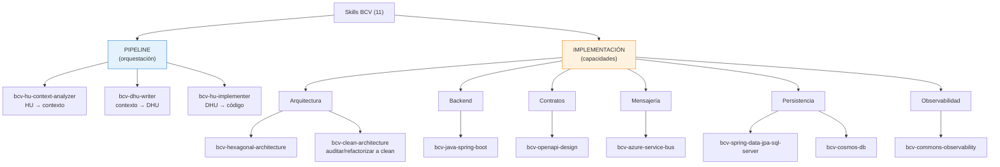
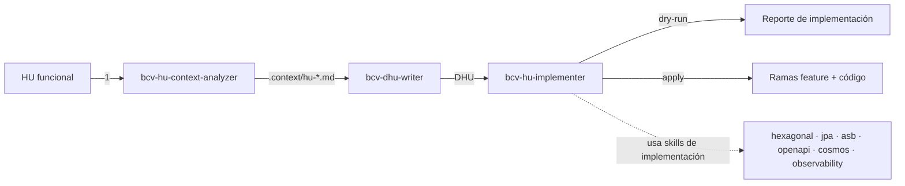

# Skills BCV — Árbol de jerarquía y flujo

Repositorio de skills para el ecosistema BCV (Interbank). Este documento explica qué skills existen, qué hace cada uno y cómo se encadenan en el flujo HU → DHU → implementación.

## 1. Árbol de jerarquía (11 skills)

```text
Skills BCV
│
├── PIPELINE (orquestación) — transforman HU → código
│   ├── bcv-hu-context-analyzer     ← HU funcional → contexto técnico
│   ├── bcv-dhu-writer              ← contexto → Historia Técnica (DHU)
│   └── bcv-hu-implementer          ← DHU → código (ramas feature)
│
└── IMPLEMENTACIÓN (capacidades especializadas) — se usan dentro de la Fase 3
    ├── Arquitectura
    │   ├── bcv-hexagonal-architecture   ← slice hexagonal (puertos, use cases, mappers)
    │   └── bcv-clean-architecture       ← auditar/refactorizar a clean/hexagonal
    ├── Backend / framework
    │   └── bcv-java-spring-boot         ← setup Spring Boot (BOM, módulos, Key Vault)
    ├── Contratos / API
    │   └── bcv-openapi-design           ← contratos REST/OpenAPI, DTOs, RFC 9457
    ├── Mensajería
    │   └── bcv-azure-service-bus        ← publishers/subscribers, topics, DLQ
    ├── Persistencia
    │   ├── bcv-spring-data-jpa-sql-server ← entidades, repos, migraciones SQL Server
    │   └── bcv-cosmos-db                ← Cosmos DB (partition key, RU/s, TTL)
    └── Observabilidad
        └── bcv-commons-observability    ← trazas, métricas, alertas, data masking
```

## 2. Diagrama de jerarquía (Mermaid)



## 3. Qué hace cada skill (paso a paso)

### Pipeline — orden de uso

| # | Skill | Entrada | Salida | Qué hace |
|---|---|---|---|---|
| 1 | `bcv-hu-context-analyzer` | HU funcional + workspace | `.context/hu-<code>.md` | Investiga la HU contra los repos con **graphify**, clasifica servicios (primary/secondary), identifica punto de inyección y detecta gaps. |
| 2 | `bcv-dhu-writer` | `.context/hu-<code>.md` | `hu-technical-refinement/HU-...-refined-....md` | Escribe la **Historia Técnica (DHU)** con CAs técnicos, endpoints, mapa técnico, DoR/DoD y config externa. |
| 3 | `bcv-hu-implementer` | DHU aprobada | Reporte + código (ramas feature) | Aplica la DHU en código: genera reporte `dry-run` y crea ramas `feature` en `apply`. **Lee y aplica** los skills de implementación. |

### Implementación — capacidades especializadas

| Skill | Qué hace | Cuándo se usa |
|---|---|---|
| `bcv-hexagonal-architecture` | Genera un slice hexagonal completo (puertos, use cases, controllers, mappers). | Agregar un caso de uso/endpoint. |
| `bcv-clean-architecture` | Audita, revisa y refactoriza un servicio BCV hacia clean/hexagonal: corrige violaciones de dependencia entre capas y genera plan de migración para servicios legacy (p. ej. `service-point-service`). | Auditar/migrar arquitectura. |
| `bcv-java-spring-boot` | Setup Spring Boot (ADS BOM, módulos, profiles, Key Vault). | Configurar el servicio. |
| `bcv-openapi-design` | Contratos REST/OpenAPI, DTOs, errores RFC 9457. | Diseñar endpoints. |
| `bcv-azure-service-bus` | Mensajería ASB (publishers, subscribers, topics, DLQ). | Eventos/colas. |
| `bcv-spring-data-jpa-sql-server` | Persistencia JPA + SQL Server (entidades, repos, migraciones). | Guardar en SQL Server. |
| `bcv-cosmos-db` | Persistencia Cosmos DB (partition key, RU/s, TTL). | Guardar en Cosmos. |
| `bcv-commons-observability` | Trazas, métricas, alertas Teams, data masking. | Observar el servicio. |

## 4. Flujo del pipeline (paso a paso)



```text
1. HU funcional
   ↓  bcv-hu-context-analyzer  (graphify + clasificar servicios)
2. .context/hu-<code>.md
   ↓  bcv-dhu-writer           (escribir DHU)
3. hu-technical-refinement/HU-...-refined-....md
   ↓  bcv-hu-implementer       (dry-run / apply)
4. Reporte + ramas feature + código
```

## 5. Resumen de roles

| Grupo | Skills | Rol |
|---|---|---|
| **Pipeline** (3) | context-analyzer, dhu-writer, implementer | Orquestan la transformación HU → código. |
| **Implementación** (8) | hexagonal, clean, spring-boot, openapi, service-bus, jpa-sql-server, cosmos, observability | Capacidades especializadas que el implementer referencia para **cómo** escribir el código. |
