# Análisis Minucioso del Ecosistema BCV (Business Customer Value)

## 1. Introducción

Este documento presenta un análisis detallado de los 7 microservicios que componen el ecosistema **BCV (Business Customer Value)** del dominio de **Apertura de Cuentas Comerciales (BACC)** de Interbank.

**Workspace analizado:** `/Users/joseluis/Downloads/bcv-bacc-account-opening-reporting-service`

**Servicios analizados:**
1. `bcv-bacc-account-opening-reporting-service`
2. `bcv-bacc-channel-activity-service`
3. `bcv-bacc-compliance-service`
4. `bcv-bacc-current-account-service`
5. `bcv-bacc-customer-service`
6. `bcv-bacc-party-lifecycle-management-service`
7. `bcv-bacc-service-point-service`

**Objetivo del documento:**
- Describir cada microservicio a nivel de componentes, responsabilidades y estructura interna.
- Identificar relaciones y dependencias entre microservicios.
- Documentar flujos de mensajería, integraciones externas y persistencia.
- Proveer diagramas Mermaid para visualizar arquitectura y comunicaciones.

---

## 2. Stack Tecnológico Común

| Capa | Tecnología |
|------|------------|
| Lenguaje | Java 21 (Java 17 en `service-point-service`) |
| Framework | Spring Boot 3.x (`ads-spring-boot-dependencies` 3.5.3 / 3.5.10) |
| Build | Maven multi-módulo |
| Arquitectura | Hexagonal / Ports & Adapters (6 de 7 servicios) |
| Mapping | MapStruct 1.6.3 + Lombok |
| API REST | Spring Web MVC + springdoc-openapi 2.7.0 |
| Mensajería | Azure Service Bus (`ads-spring-boot-starter-messaging`) |
| Bases de datos | SQL Server (JPA/Hibernate), Azure Cosmos DB (algunos) |
| Clientes HTTP | OpenFeign + starters corporativos |
| Seguridad | JWT Bearer + Azure Key Vault + Spring Cloud Config |
| Observabilidad | `bcv-commons-observability`, Spring Actuator, New Relic |
| Calidad | JaCoCo, SpotBugs, PMD, Sonar |
| CI/CD | Azure DevOps + Helm + AKS |
| Documentación | Backstage TechDocs + MkDocs |

---

## 3. Vista General del Ecosistema

### 3.1 Diagrama de Contexto (C4 - Nivel 1)

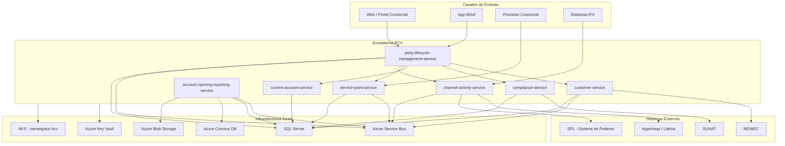

### 3.2 Diagrama de Relaciones entre Microservicios

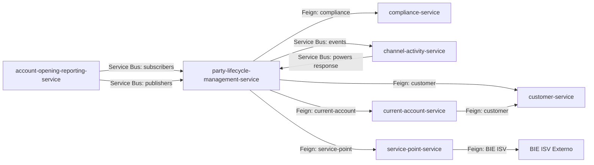

---

## 4. Matriz de Comunicación entre Microservicios

| Origen | Destino | Tipo | Tecnología | Propósito |
|--------|---------|------|------------|-----------|
| `party-lifecycle-management-service` | `customer-service` | Síncrono | OpenFeign (`BaccCustomerClient`) | Consultar/crear clientes |
| `party-lifecycle-management-service` | `compliance-service` | Síncrono | OpenFeign (`ComplianceClient`) | Validaciones de compliance |
| `party-lifecycle-management-service` | `current-account-service` | Síncrono | OpenFeign (`BaccAccountClient`) | Operaciones de cuenta |
| `party-lifecycle-management-service` | `service-point-service` | Síncrono | OpenFeign (`ServicePointClient`) | Gestión de puntos de servicio |
| `party-lifecycle-management-service` | `channel-activity-service` | Asíncrono | Azure Service Bus | Notificaciones, validaciones SPL, tarifas |
| `channel-activity-service` | `party-lifecycle-management-service` | Asíncrono | Azure Service Bus | Respuestas de validación SPL |
| `current-account-service` | `customer-service` | Síncrono | OpenFeign (`AccountImpactsClient`) | Impactos de cuenta y cliente |
| `account-opening-reporting-service` | `channel-activity-service` | Asíncrono | Azure Service Bus | Exportación de reportes |
| `account-opening-reporting-service` | Todos (eventos) | Asíncrono | Azure Service Bus | Ingesta de reportes Teradata |
| `service-point-service` | Sistemas externos | Síncrono | OpenFeign (`BieServicePointClient`) | Integración con BIE ISV |

---

## 5. Análisis Detallado por Microservicio

---

### 5.1 `bcv-bacc-account-opening-reporting-service`

#### 5.1.1 Propósito
Centraliza la **ingesta, persistencia y consulta de reportes** relacionados con aperturas de cuenta comercial y envíos hacia Teradata. Expone APIs REST para consultas paginadas de expedientes comerciales y reportes Teradata, y consume mensajes de Azure Service Bus para procesar datos de forma asíncrona.

#### 5.1.2 Estructura de Módulos

```
bcv-bacc-account-opening-reporting-service/
├── bcv-bacc-account-opening-reporting-app/      # Bootstrap, config, OpenAPI
├── bcv-bacc-account-opening-reporting-core/     # Dominio, use cases, ports
├── bcv-bacc-account-opening-reporting-input/    # REST controllers, subscribers
└── bcv-bacc-account-opening-reporting-output/   # Repositorios JPA/Cosmos, adapters
```

#### 5.1.3 Diagrama de Arquitectura Interna

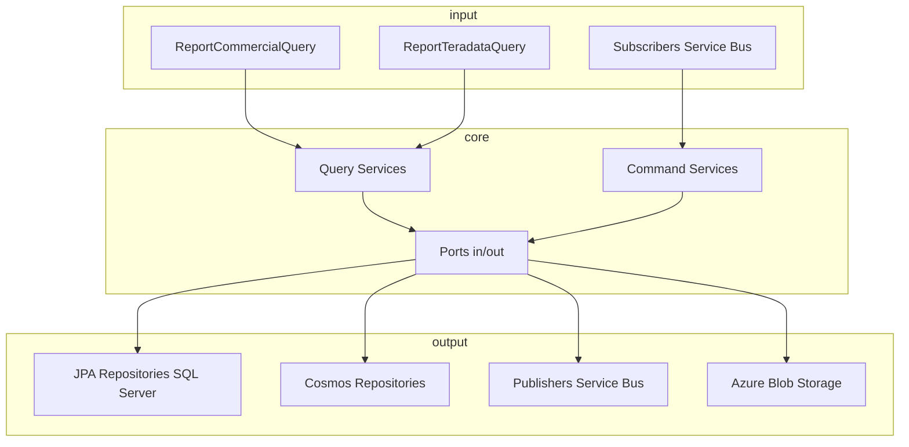

#### 5.1.4 Endpoints REST

| Controller | Método | Ruta | Descripción |
|------------|--------|------|-------------|
| `ReportTeradataQuery` | GET | `/teradata/natural-person` | Reportes Teradata PN por rango de fechas |
| `ReportTeradataQuery` | GET | `/teradata/legal-entity` | Reportes Teradata PJ por rango de fechas |
| `ReportTeradataQuery` | GET | `/teradata/gtp` | Reportes GTP por rango de fechas |
| `ReportCommercialQuery` | GET | `/commercial/expedients/business-account` | Expedientes comerciales PJ paginados |
| `ReportCommercialQuery` | GET | `/commercial/expedients/business-account-pn` | Expedientes comerciales PN paginados |
| `ReportCommercialQuery` | GET | `/commercial/expedients/current-account` | Expedientes cuenta corriente paginados |

#### 5.1.5 Use Cases / Servicios en Core

| Servicio | Tipo | Descripción |
|----------|------|-------------|
| `ReportTeradataQueryService` | Query | Consulta reportes Teradata |
| `BusinessAccountPJQueryService` | Query | Consulta expedientes PJ |
| `BusinessAccountPNQueryService` | Query | Consulta expedientes PN |
| `CurrentAccountCommercialExpedientQueryService` | Query | Consulta cuenta corriente comercial |
| `CurrentAccountCommercialExpedientService` | Command | Sincronización de expedientes CCE |
| `ReportProcessService` | Command | Procesamiento de reportes GTP |

#### 5.1.6 Ports

**Ports In:**
- `ReportTeradataInQueryPort`
- `BusinessAccountPJInQueryPort`
- `BusinessAccountPNInQueryPort`
- `CurrentAccountCommercialExpedientQueryPort`
- `CurrentAccountCommercialExpedientInCommandPort`
- `ReportProcessInCommandPort`

**Ports Out:**
- `ReportTeradataPersistenceOutPort`
- `BusinessAccountPJExpedientPersistenceOutPort`
- `BusinessAccountPNExpedientPersistenceOutPort`
- `CurrentAccountCommercialExpedientOutPort`
- `ReportCurrentAccountExportOutPort`
- `BcvNotificationOutPort`
- `FileSystemStorageOutPort`

#### 5.1.7 Adapters

| Adapter | Responsabilidad |
|---------|-----------------|
| `ReportTeradataPersistenceAdapter` | Persistencia de reportes Teradata |
| `BusinessAccountPJExpedientPersistenceAdapter` | Persistencia expedientes PJ |
| `BusinessAccountPNExpedientPersistenceAdapter` | Persistencia expedientes PN |
| `CurrentAccountCommercialExpedientPersistenceAdapter` | Dual persistence SQL + Cosmos |
| `ReportCurrentAccountExportAdapter` | Exportación de reportes CCE |
| `BcvNotificationAdapter` | Notificaciones de eventos |
| `FileSystemStorageAdapter` | Almacenamiento de archivos en Blob |

#### 5.1.8 Entidades JPA

| Entidad | Tabla / Uso |
|---------|-------------|
| `ReportTeradataNaturalPerson` | Reportes PN Teradata |
| `ReportTeradataLegalEntity` | Reportes PJ Teradata |
| `ReportTeradataGtp` | Reportes GTP |
| `Expedient` | Proyección de expedientes |
| `CurrentAccountCommercialV2` | Cuenta corriente comercial |
| `BusinessAccountPNExpedient` | Cuenta negocios PN |
| `BusinessAccountPJExpedient` | Cuenta negocios PJ |

#### 5.1.9 Cosmos DB

- Database: `AssiExpedient`
- Repositorios: `CosmosBasePagingRepository`, repositorios comerciales
- Uso: Consultas paginadas de expedientes comerciales

#### 5.1.10 Subscribers de Azure Service Bus

| Subscriber | Queue/Topic | Handler |
|------------|-------------|---------|
| `reportTeradataNPSubscriber` | Queue `que-bcv-ars-reporting-data-ingestion-pn-req-01` | `ReportTeradataNaturalPersonSubscriberHandler` |
| `reportTeradataLESubscriber` | Queue `que-bcv-ars-reporting-data-ingestion-pj-req-01` | `ReportTeradataLegalEntitySubscriberHandler` |
| `reportTeradataGtpSubscriber` | Queue `que-bcv-ars-reporting-data-ingestion-gtp-req-01` | `ReportTeradataGtpSubscriberHandler` |
| `currentAccountExpedientSyncUpsertSubscriber` | Topic `bcv.bacc.report` / Sub `bacc.report.commercial.cce_upsert` | `CurrentAccountCommercialExpedientSyncSaveSubscriberHandler` |
| `currentAccountExpedientReportExportSubscriber` | Topic `bcv.bacc.report` / Sub `bacc.report.commercial.cce_export` | `ReportCurrentAccountExportSubscriberHandler` |

#### 5.1.11 Publishers de Azure Service Bus

| Publisher | Topic | Propósito |
|-----------|-------|-----------|
| `BvcEventNotificationPublisher` | `bcv.event` | Notificación de eventos BCV |
| `ReportCurrentAccountExportPublisherHandler` | `bcv.bacc.report` | Publicar solicitud de exportación CCE |

#### 5.1.12 Configuraciones Clave

- `commercial.report.range-days: 90`
- `azure.assi.cosmos.data-sources.acdbeu2c001hubd.database: AssiExpedient`
- SQL Server schema: `BcvBaccReport`
- Blob Storage: `bcw-files-templates`, `bcw-report-files`

#### 5.1.13 Relaciones con Otros Servicios

- ** party-lifecycle-management-service**: consume eventos de upsert de expedientes comerciales y publica eventos de exportación.
- **channel-activity-service**: publica eventos de exportación que channel-activity puede procesar.

---

### 5.2 `bcv-bacc-channel-activity-service`

#### 5.2.1 Propósito
Actúa como **orquestador de integraciones de actividad de canal**. Recibe solicitudes vía Azure Service Bus, aplica lógica de negocio y delega a servicios IFX, colas/topics de mensajería o plataformas de notificación (Latinia/Hyperloop).

#### 5.2.2 Estructura de Módulos

```
bcv-bacc-channel-activity-service/
├── bcv-bacc-channel-activity-app/       # Bootstrap, config
├── bcv-bacc-channel-activity-core/      # Use cases, ports
├── bcv-bacc-channel-activity-input/     # Subscribers
└── bcv-bacc-channel-activity-output/    # Adapters, publishers, clients
```

#### 5.2.3 Diagrama de Arquitectura Interna

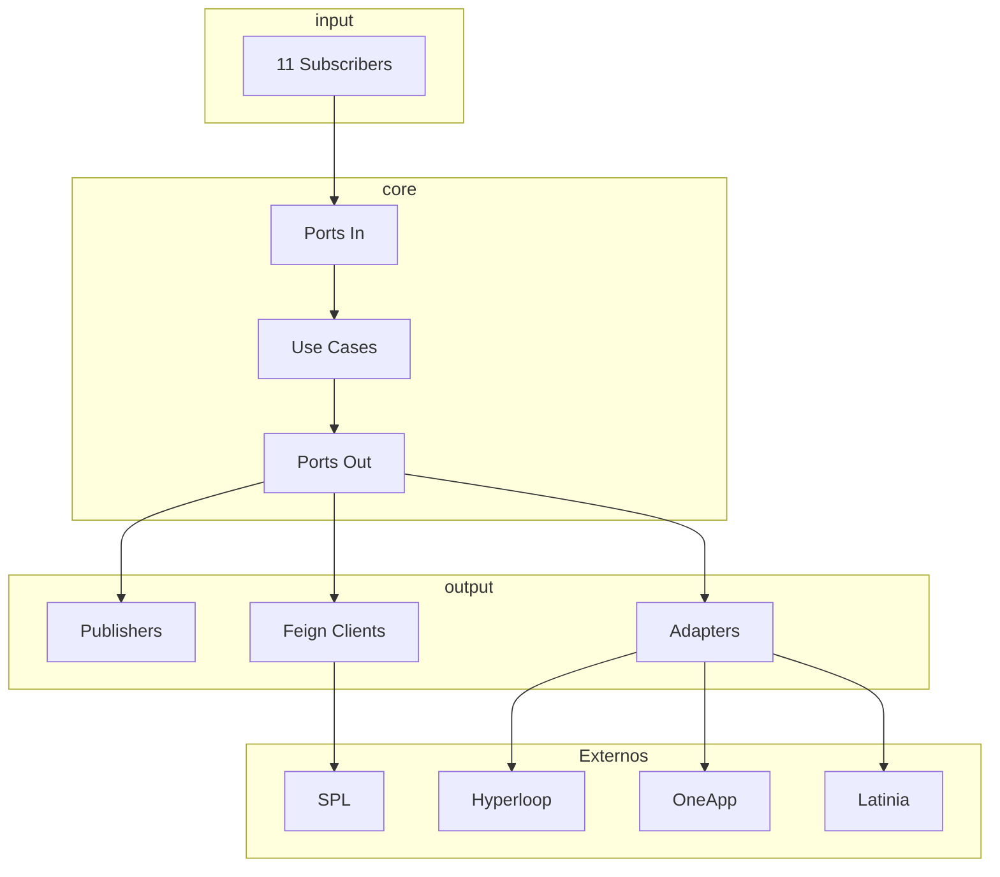

#### 5.2.4 Use Cases en Core

| Use Case | Descripción |
|----------|-------------|
| `AviNotificationUseCase` | Notificaciones AVI |
| `BcvNotificationUseCase` | Notificaciones BCV |
| `EmailNotificationUseCase` | Notificaciones por email |
| `GenerateFilesUseCase` | Generación de archivos/documentos |
| `LdpdConsentUseCase` | Consentimientos LDPD |
| `MonitorFraudUseCase` | Monitoreo de fraude |
| `OneAppUseCase` | Integración OneApp |
| `PowersValidationSplUseCase` | Validación de poderes SPL |
| `TariffAcountUseCase` | Gestión de tarifas de cuenta |

#### 5.2.5 Ports

**Ports In (9):**
- `AviNotificationInputPort`, `BcvNotificationInputPort`, `EmailNotificationInputPort`, `GenerateFilesInputPort`, `LdpdServiceInputPort`, `MonitorServiceInputPort`, `OneAppInputPort`, `PowersSplValidationInputPort`, `TariffAccountInputPort`

**Ports Out (9):**
- `AviNotificationOutputPort`, `BcvNotificationOutputPort`, `DocumentGenerateOutputPort`, `EmailNotificationOutputPort`, `LdpdServiceOutputPort`, `MonitorServiceOutputPort`, `OneAppOutputPort`, `PowersSplValidationOutputPort`, `TariffAccountOutputPort`

#### 5.2.6 Adapters

| Adapter | Responsabilidad |
|---------|-----------------|
| `AviNotificationAdapter` | Notificaciones AVI |
| `BcvNotificationAdapter` | Notificaciones BCV |
| `DocumentGenerateAdapter` | Generación de documentos |
| `EmailNotificationLatiniaAdapter` | Envío de emails vía Latinia |
| `LDPDServiceAdapter` | Servicio LDPD |
| `MonitorServiceAdapter` | Monitoreo/fraude |
| `OneAppServiceAdapter` | Integración OneApp |
| `TariffServiceAdapter` | Gestión de tarifas |
| `PowersSplValidationDataAccess` | Acceso a validación SPL |

#### 5.2.7 Subscribers (11)

| Subscriber | Descripción |
|------------|-------------|
| `AviNotificaionSubscriberHandler` | Notificaciones AVI |
| `BcvNotificationSubscriberHandler` | Notificaciones BCV |
| `EmailFilesSubscriberHandler` | Archivos de email |
| `EmailFilesCallbackSubscriberHandler` | Callback de archivos email |
| `EmailNotificationSubscriberHandler` | Notificaciones email |
| `LdpdMessageSubscriberHandler` | Mensajes LDPD |
| `MonitorMessageSubscriberHandler` | Mensajes de monitoreo |
| `OneAppMessageSubscriberHandler` | Mensajes OneApp |
| `PowersResponseSubscriberHandler` | Respuestas SPL (connection string) |
| `PowersResponseSubscriberMIHandler` | Respuestas SPL (Managed Identity) |
| `PowersValidationSubscriberHandler` | Validación de poderes |
| `UpdateTariffSubscriberHandler` | Actualización de tarifas |

#### 5.2.8 Publishers (8)

| Publisher | Descripción |
|-----------|-------------|
| `AviNotificationMiPublisher` | Notificaciones AVI vía MI |
| `BvcNotificationPublisher` | Notificaciones BCV |
| `EmailNotificationPublisher` | Emails |
| `GenerateDocumentsPublisher` | Generación documentos |
| `OneAppMIPublisher` | OneApp vía MI |
| `PowersResponsePublisher` | Respuestas SPL |
| `PowersValidationMIPublisher` | Validación SPL vía MI |
| `PowersValidationPublisher` | Validación SPL |

#### 5.2.9 Integraciones Externas

- **SPL (Sistema de Poderes Legal)**: vía Azure Service Bus con Managed Identity.
- **Hyperloop**: generación de documentos PDF/Excel en Azure Storage.
- **Latinia**: notificaciones SMS/email.
- **OneApp**: integración con app móvil.

#### 5.2.10 Relaciones con Otros Servicios

- **party-lifecycle-management-service**: recibe mensajes de PLM para validación SPL, tarifas, notificaciones; responde mensajes a PLM.
- No tiene controllers REST expuestos (procesador stateless).

---

### 5.3 `bcv-bacc-compliance-service`

#### 5.3.1 Propósito
Servicio de **validaciones de compliance** para el proceso de apertura de cuentas comerciales. Valida información del cliente, expediente y representantes legales contra reglas de negocio y servicios externos (SUNAT, VCL, CCE).

#### 5.3.2 Estructura de Módulos

```
bcv-bacc-compliance-service/
├── bcv-bacc-compliance-app/        # Bootstrap, config, exception handlers
├── bcv-bacc-compliance-core/       # Use cases, estrategias de validación
├── bcv-bacc-compliance-input/      # REST controllers
└── bcv-bacc-compliance-output/     # Adapters, repositorios, Feign clients
```

#### 5.3.3 Diagrama de Arquitectura Interna

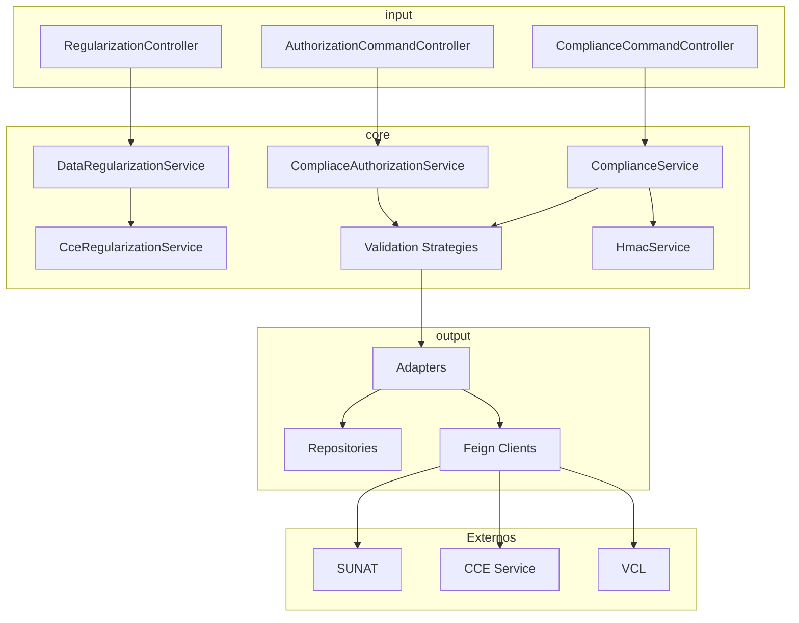

#### 5.3.4 Endpoints REST

| Controller | Método | Ruta | Descripción |
|------------|--------|------|-------------|
| `ComplianceCommandController` | POST | `/compliance/verify` | Verificar compliance |
| `ComplianceCommandController` | POST | `/compliance/verify-integrity` | Verificar integridad (HMAC) |
| `AuthorizationCommandController` | POST | `/compliance/authorization` | Autorizaciones |
| `RegularizationController` | POST | `/compliance/regularization` | Regularización de datos |

#### 5.3.5 Use Cases / Servicios

| Servicio | Descripción |
|----------|-------------|
| `ComplianceService` | Validación principal de compliance |
| `CompliaceAuthorizationService` | Autorizaciones |
| `DataRegularizationService` | Regularización de datos |
| `CceRegularizationService` | Regularización CCE |
| `HmacService` | Firma/verificación HMAC |
| `ComplianceRuleValidator` | Validador de reglas |
| `TamperingGuard` | Detección de tampering |

#### 5.3.6 Estrategias de Validación

| Estrategia | Descripción |
|------------|-------------|
| `ComplianceValidationStrategy` | Estrategia base |
| `CceValidationStrategy` | Validación CCE |
| `CompositeOptionalValidationStrategy` | Validaciones opcionales compuestas |
| `ValidationStrategyRegistry` | Registro de estrategias |

#### 5.3.7 Ports

**Ports In:**
- `AuthorizationCommandPort`, `ComplianceCommandPort`, `CceRegularizationPort`, `DataRegularizationPort`

**Ports Out:**
- `CceServicePort`, `VclServicePort`, `ComplianceRepositoryPort`, `ExpedientRepositoryPort`, `TamperingRepositoryPort`, `TaxPayerTypeRepositoryPort`, `CiiuRepositoryPort`

#### 5.3.8 Adapters

| Adapter | Responsabilidad |
|---------|-----------------|
| `ComplianceAdapter` | Validaciones principales |
| `CceServiceAdapter` / `CceMockServiceAdapter` | Cliente CCE |
| `VclServiceAdapter` | Cliente VCL |
| `CiiuRepositoryAdapter` | Repositorio CIIU |
| `ExpedientRepositoryAdapter` | Repositorio expedientes |
| `TamperingRepositoryAdapter` | Repositorio intentos de tampering |
| `TaxPayerTypeRepositoryAdapter` | Repositorio tipos de contribuyente |

#### 5.3.9 Feign Clients

| Client | Destino |
|--------|---------|
| `CceFeignClient` | Servicio CCE |
| `VclFeignClient` | Servicio VCL |
| `RiskClient` | Servicio de riesgo (comentado) |

#### 5.3.10 Entidades JPA

| Entidad | Descripción |
|---------|-------------|
| `CiiuEntity` | Códigos CIIU |
| `DataValidateEntity` | Datos validados |
| `ExpedientEntity` | Expedientes |
| `TamperingAttemptsEntity` | Intentos de tampering |
| `TaxPayerTypeEntity` | Tipos de contribuyente |

#### 5.3.11 Configuraciones Clave

- `bcv.tampering-detection.enabled`
- `security.hmac.secret`
- `ComplianceValidationConfig` con prefijo de propiedades

#### 5.3.12 Relaciones con Otros Servicios

- **party-lifecycle-management-service**: PLM invoca compliance vía Feign para validaciones.

---

### 5.4 `bcv-bacc-current-account-service`

#### 5.4.1 Propósito
Gestiona las operaciones de **cuenta corriente comercial** dentro del proceso BACC: creación, consulta y operaciones sobre cuentas corrientes de empresas.

#### 5.4.2 Estructura de Módulos

```
bcv-bacc-current-account-service/
├── bcv-bacc-current-account-app/      # Bootstrap, config
├── bcv-bacc-current-account-core/     # Use cases, ports
├── bcv-bacc-current-account-input/    # REST controllers
└── bcv-bacc-current-account-output/   # Adapters, repositories, Feign clients
```

#### 5.4.3 Diagrama de Arquitectura Interna

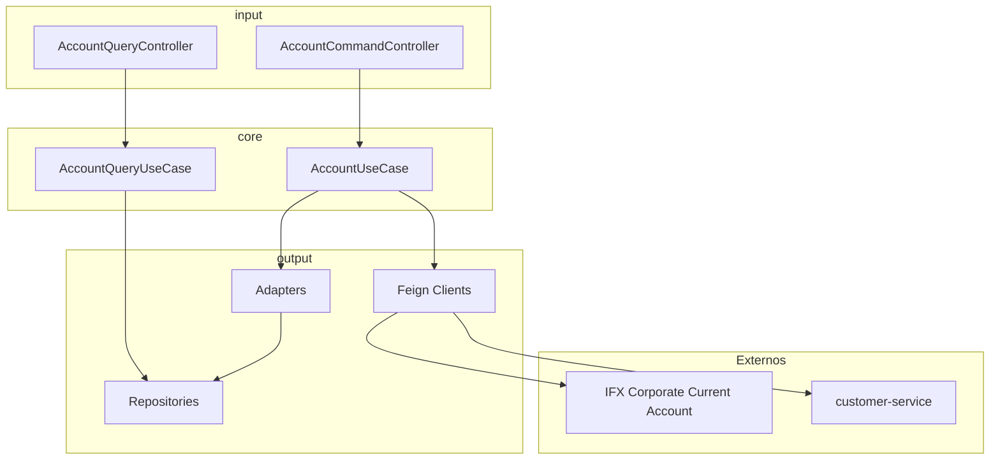

#### 5.4.4 Endpoints REST

| Controller | Método | Ruta | Descripción |
|------------|--------|------|-------------|
| `AccountCommandController` | POST/PUT | `/accounts` | Crear/actualizar cuenta corriente |
| `AccountQueryController` | GET | `/accounts/{id}` | Consultar cuenta corriente |

#### 5.4.5 Use Cases

| Use Case | Descripción |
|----------|-------------|
| `AccountUseCase` | Caso de uso de comandos de cuenta |
| `AccountQueryUseCase` | Caso de uso de consultas de cuenta |

#### 5.4.6 Ports

**Ports In:**
- `AccountCommandInPort`, `AccountQueryInPort`

**Ports Out:**
- `AccountRepositoryOutPort`, `AccountServicePort`, `CorporateCurrentAccountServicePort`, `CorrespondenceServicePort`, `SavingsAccountServicePort`

#### 5.4.7 Adapters

| Adapter | Responsabilidad |
|---------|-----------------|
| `AccountRepositoryOutAdapter` | Persistencia de cuenta |
| `AccountServiceAdapter` | Servicio de cuenta |
| `CorporateCurrentAccountServiceAdapter` | Cuenta corriente corporativa IFX |
| `CorrespondenceServiceAdapter` | Correspondencia |

#### 5.4.8 Feign Client

| Client | Destino |
|--------|---------|
| `AccountImpactsClient` | Impactos de cuenta (customer-service / IFX) |

#### 5.4.9 Entidades JPA

| Entidad | Descripción |
|---------|-------------|
| `AccountEntity` | Cuenta corriente |
| `ExpedientEntity` | Expediente asociado |

#### 5.4.10 Repositorios

- `AccountRepository`
- `ExpedientRepository`

#### 5.4.11 Relaciones con Otros Servicios

- **party-lifecycle-management-service**: PLM invoca current-account vía Feign para crear/operar cuentas.
- **customer-service**: consulta impactos de cliente vía Feign.

---

### 5.5 `bcv-bacc-customer-service`

#### 5.5.1 Propósito
Gestiona la información de **clientes** (personas naturales y jurídicas) para el proceso de apertura de cuentas comerciales. Incluye creación, actualización, consulta y validación de datos de clientes, representantes legales y socios.

#### 5.5.2 Estructura de Módulos

```
bcv-bacc-customer-service/
├── bcv-bacc-customer-app/         # Bootstrap, config
├── bcv-bacc-customer-core/        # Domain model, value objects, use cases
├── bcv-bacc-customer-input/       # REST controllers
└── bcv-bacc-customer-output/      # Adapters, repositories, Feign clients
```

#### 5.5.3 Diagrama de Arquitectura Interna

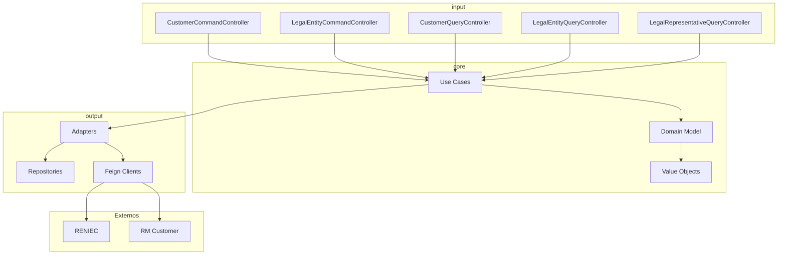

#### 5.5.4 Endpoints REST

| Controller | Método | Ruta | Descripción |
|------------|--------|------|-------------|
| `CustomerCommandController` | POST/PUT | `/customers` | Crear/actualizar cliente |
| `LegalEntityCommandController` | POST/PUT | `/legal-entities` | Crear/actualizar persona jurídica |
| `CustomerQueryController` | GET | `/customers/{id}` | Consultar cliente |
| `LegalEntityQueryController` | GET | `/legal-entities/{id}` | Consultar persona jurídica |
| `LegalRepresentativeQueryController` | GET | `/legal-representatives` | Consultar representantes legales |

#### 5.5.5 Use Cases

| Use Case | Descripción |
|----------|-------------|
| `CreateCustomerService` | Crear cliente |
| `ReserveCustomerCommandService` | Reservar cliente |
| `UpdateLegalEntityUseCase` | Actualizar persona jurídica |
| `VerifyRegularizationRmUseCase` | Verificar regularización RM |
| `AuthConfirmUseCase` | Confirmación de autorización |
| `LegalEntityQueryUseCase` | Consulta de persona jurídica |
| `LegalRepresentativeQueryUseCase` | Consulta de representantes legales |
| `PersonalInfoQueryInUseCase` | Consulta de información personal |

#### 5.5.6 Domain Model y Value Objects

| Domain / VO | Descripción |
|-------------|-------------|
| `CustomerDomain` | Cliente |
| `LegalEntityDomain` | Persona jurídica |
| `NaturalPersonDomain` | Persona natural |
| `LegalRepresentativeDomain` | Representante legal |
| `PartnerDomain` | Socio |
| `AddressDomain` | Dirección |
| `PhoneDomain` | Teléfono |
| `EmailDomain` | Email |
| `IdentityDocument` | Documento de identidad |
| `CustomerId` | ID de cliente |
| `LegalEntityId` | ID de persona jurídica |

#### 5.5.7 Ports

**Ports In (Commands):**
- `AuthConfirmCommand`, `CreateCustomerCommand`, `ReserveCustomerCommandPort`, `UpdateLegalEntityCommand`, `VerifyRegularizationRmCommand`

**Ports In (Queries):**
- `LegalEntityQueryInPort`, `LegalRepresentativeQueryInPort`, `PersonalInfoQueryInPort`

**Ports Out:**
- `CustomerRepositoryPort`, `CustomerServicePort`, `ExpedientServicePort`, `LegalEntityRepositoryOutPort`, `LegalRepresentativeRepositoryOutPort`, `PersonalInfoRepositoryOutPort`

#### 5.5.8 Adapters

| Adapter | Responsabilidad |
|---------|-----------------|
| `CustomerPersistenceAdapter` | Persistencia cliente |
| `CustomerServiceAdapter` | Servicio cliente |
| `ExpedientServiceAdapter` | Servicio expediente |
| `LegalEntityPersistenceAdapter` | Persistencia persona jurídica |
| `LegalRepresentativeRepositoryOutAdapter` | Persistencia representante legal |
| `PersonalInfoPersistenceAdapter` | Persistencia información personal |

#### 5.5.9 Feign Clients

| Client | Destino |
|--------|---------|
| `ExpedientClient` | Servicio de expedientes |
| `FakeRmCustomerClient` | RM Customer (fake para feature flag) |
| `RetrieveBadAddressClient` | Recuperación de direcciones |

#### 5.5.10 Entidades JPA

| Entidad | Descripción |
|---------|-------------|
| `AddressEntity` | Dirección |
| `CiiuEntity` | CIIU |
| `LegalEntityEntity` | Persona jurídica |
| `LegalRepresentativeEntity` | Representante legal |
| `NaturalPersonEntity` | Persona natural |
| `PartnerEntity` | Socio |
| `PersonalInfoEntity` | Información personal |
| `SectorEntity` / `SubSectorEntity` | Sector económico |

#### 5.5.11 Feature Flags

- `features.rm-customer.fake-apim.enabled` (default `false`)

#### 5.5.12 Relaciones con Otros Servicios

- **party-lifecycle-management-service**: PLM consulta/crea clientes vía Feign.
- **current-account-service**: current-account consulta impactos vía Feign.

---

### 5.6 `bcv-bacc-party-lifecycle-management-service`

#### 5.6.1 Propósito
Es el **orquestador central del ciclo de vida del expediente** de apertura de cuentas comerciales. Gestiona la creación, autorización, regularización, validación de poderes y reserva de cuentas. Es el servicio con mayor complejidad y más integraciones.

#### 5.6.2 Estructura de Módulos

```
bcv-bacc-party-lifecycle-management-service/
├── bcv-bacc-party-lifecycle-management-app/         # Bootstrap, config, advice
├── bcv-bacc-party-lifecycle-management-core/        # Domain, use cases, 30+ ports
├── bcv-bacc-party-lifecycle-management-input/       # REST controllers, subscribers
└── bcv-bacc-party-lifecycle-management-output/      # 30+ adapters, publishers, clients
```

#### 5.6.3 Diagrama de Arquitectura Interna

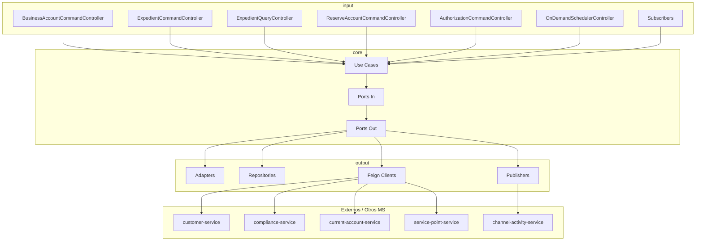

#### 5.6.4 Endpoints REST

| Controller | Método | Ruta | Descripción |
|------------|--------|------|-------------|
| `BusinessAccountCommandController` | POST | `/business-accounts` | Crear cuenta de negocios |
| `ExpedientCommandController` | POST/PUT | `/expedients` | Comandos de expediente |
| `ExpedientQueryController` | GET | `/expedients/{number}` | Consultar expediente |
| `ReserveAccountCommandController` | POST | `/accounts/reserve` | Reservar cuenta |
| `AuthorizationCommandController` | POST | `/expedients/authorize` | Autorizar expediente |
| `OnDemandSchedulerController` | POST | `/scheduler/run` | Ejecutar tareas programadas on-demand |

#### 5.6.5 Use Cases

| Use Case | Descripción |
|----------|-------------|
| `CreateBusinessAccountService` | Crear cuenta de negocios |
| `AuthorizationService` | Autorización de expedientes |
| `RegularizationService` | Regularización |
| `ReservationService` | Reserva de cuentas |
| `ExpedientStatusService` | Gestión de estados de expediente |
| `GetExpedientByNumberService` | Consulta de expediente |
| `PowersValidationService` | Validación de poderes |
| `WaitingDataActivaService` | Verificación de data activa |
| `PendingAuthorizationExpirationService` | Expiración de autorizaciones pendientes |
| `PendingRegularizationExpirationService` | Expiración de regularizaciones pendientes |
| `PendingRegularizationReminderService` | Recordatorios de regularización |

#### 5.6.6 Ports (30+)

**Ports In:**
- `AuthorizationCommandPort`, `BusinessAccountCommandPort`, `ExpedientCommandPort`, `ExpedientQueryCommandPort`, `PowersValidationCommandPort`, `RegularizationCommandPort`, `ReservationComandPort`, `WaitingDataActivaCommandPort`
- Schedulers: `PendingAuthorizationExpirationCommandPort`, `PendingRegularizationExpirationCommandPort`, `PendingRegularizationReminderCommandPort`

**Ports Out:**
- Servicios externos: `CustomerServicePort`, `ComplianceServicePort`, `CurrentAccountServicePort`, `AuthorizationServicePort`, `ExpedientServicePort`
- Validaciones: `CceValidationServicePort`, `ChannelValidationServicePort`, `DataValidationServicePort`, `SplValidationServicePort`
- Notificaciones: `AviNotificationCommandPort`, `EmailNotificationServicePort`, `EmailWithAttachmentServicePort`, `GtpEmailNotificationServicePort`, `LdpdServicePort`, `MonitorServicePort`, `OneAppNotificationServicePort`, `ReportTeradataServicePort`
- Service Point / Tray: `ServicePointCommandPort`, `ServicePointServicePort`, `ServicePointRepositoryPort`, `ServiceTrayPort`, `ServiceTrayServicePort`, `ServiceTrayRepositoryPort`
- Repositorios: `AccountRepositoryPort`, `ExpedientRepositoryPort`, `ExpedientHistoryRepositoryPort`, `SplInteractionRepositoryPort`
- Otros: `FeatureFlagPort`, `TariffAccountServicePort`, `TemplatesServicePort`, `WaitingDataActivaVerifyRmServicePort`

#### 5.6.7 Adapters (30+)

| Categoría | Adapters |
|-----------|----------|
| Repositorios | `AccountRepositoryAdapter`, `ExpedientRepositoryAdapter`, `ExpedientHistoryRepositoryAdapter`, `ServicePointRepositoryAdapter`, `ServiceTrayRepositoryAdapter`, `SplInteractionRepositoryAdapter` |
| Servicios externos | `CustomerServiceAdapter`, `ComplianceServiceAdapter`, `CurrentAccountServiceAdapter`, `AuthorizationServiceAdapter`, `ExpedientServiceAdapter` |
| Validaciones | `CceValidationServiceAdapter`, `ChannelValidationServiceAdapter`, `DataValidationServiceAdapter`, `SplValidationServiceAdapter` |
| Notificaciones | `AviNotificationAdapter`, `EmailNotificationAdapter`, `GtpEmailNotificationAdapter`, `LDPDServiceAdapter`, `MonitorServiceAdapter`, `OneAppServiceAdapter`, `ReportTeradataServiceAdapter` |
| Service Point | `ServicePointAdapter`, `ServicePointServicePortAdapter`, `ServiceTrayAdapter` |
| Otros | `FeatureFlagAdapter`, `TariffAccountAdapter`, `TemplatesConfigAdapter`, `WaitingDataActivaVerifyRmServiceAdapter` |

#### 5.6.8 Feign Clients

| Client | Destino |
|--------|---------|
| `BaccAccountClient` | current-account-service |
| `BaccCustomerClient` | customer-service |
| `ComplianceClient` | compliance-service |
| `CryptoClient` | Crypto/seguridad |
| `ExpedientClient` | Servicio de expedientes |
| `HyplSecurityClient` | Hyperloop security |
| `ServicePointClient` | service-point-service |

#### 5.6.9 Publishers (16)

| Publisher | Descripción |
|-----------|-------------|
| `AviNotificationPublisher` | Notificaciones AVI |
| `EmailNotificationPublisher` | Emails |
| `GenerateDocumentsPublisher` | Generar documentos |
| `GtpEmailNotificationPublisher` | Emails GTP |
| `LDPDNotificationPublisher` | Notificaciones LDPD |
| `MonitorMessagePublisher` | Mensajes de monitoreo |
| `OneAppNotificationPublisher` | Notificaciones OneApp |
| `PowersValidationPublisher` | Validación de poderes |
| `ReportTeradataGtpPublisher` | Reporte Teradata GTP |
| `ReportTeradataLEPublisher` | Reporte Teradata PJ |
| `ReportTeradataNPPublisher` | Reporte Teradata PN |
| `ServicePointLimitsPublisher` | Límites de punto de servicio |
| `ServicePointPublisher` | Punto de servicio |
| `ServiceTrayPublisher` | Bandeja de servicio |
| `UpdateTariffPublisher` | Actualización de tarifa |
| `WaitingDataActivaVerifyRmPublisher` | Verificación data activa RM |

#### 5.6.10 Subscribers

| Subscriber | Descripción |
|------------|-------------|
| `OnDemandSchedulerSubscriberHandler` | Ejecución on-demand de schedulers |
| `PowersResponseSubscriberHandler` | Respuesta de validación SPL |
| `WaitingDataActivaSubscriberHandler` | Respuesta de data activa |

#### 5.6.11 Entidades JPA

| Entidad | Descripción |
|---------|-------------|
| `AccountEntity` | Cuenta |
| `ChannelEntity` | Canal |
| `ConsumerEntity` | Consumidor |
| `ExpedientEntity` | Expediente |
| `ExpedientHistoryEntity` | Historial de expediente |
| `ServicePointEntity` | Punto de servicio |
| `ServiceTrayEntity` | Bandeja de servicio |
| `SplInteractionEntity` | Interacción SPL |

#### 5.6.12 Feature Flags

- `feature-flags.service-point-delete-user-enabled`

#### 5.6.13 Schedulers (ShedLock)

- `PendingAuthorizationExpirationService`
- `PendingRegularizationExpirationService`
- `PendingRegularizationReminderService`

#### 5.6.14 Relaciones con Otros Servicios

- **customer-service**: consulta/crea clientes vía Feign.
- **compliance-service**: valida compliance vía Feign.
- **current-account-service**: reserva/crea cuentas vía Feign.
- **service-point-service**: gestiona puntos de servicio vía Feign.
- **channel-activity-service**: envía mensajes de notificación, validación SPL, tarifas vía Service Bus.
- **account-opening-reporting-service**: publica eventos para reportes Teradata y CCE.

---

### 5.7 `bcv-bacc-service-point-service`

#### 5.7.1 Propósito
Gestiona **puntos de servicio, bandejas de servicio y privilegios** de usuarios en el proceso de apertura de cuentas comerciales. Es el servicio más antiguo del ecosistema, con estructura plana (no hexagonal) y Java 17.

#### 5.7.2 Estructura del Proyecto

```
bcv-bacc-service-point-service/
├── src/main/java/pe/interbank/bcv/baccservicepoint/
│   ├── client/
│   ├── config/
│   ├── controller/
│   ├── domain/
│   ├── dto/
│   ├── error/
│   ├── facade/
│   ├── mapper/
│   ├── publisher/
│   ├── repository/
│   ├── service/
│   ├── subscriber/
│   ├── util/
│   └── validator/
```

#### 5.7.3 Diagrama de Arquitectura Interna

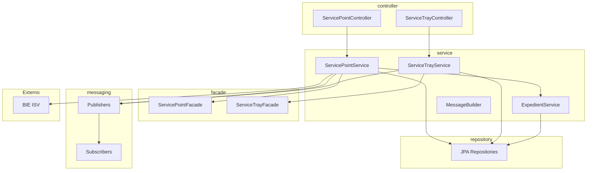

#### 5.7.4 Endpoints REST

| Controller | Método | Ruta | Descripción |
|------------|--------|------|-------------|
| `ServicePointController` | POST/GET/PUT | `/service-points` | Gestión de puntos de servicio |
| `ServiceTrayController` | POST/GET/PUT | `/service-trays` | Gestión de bandejas de servicio |

#### 5.7.5 Servicios Principales

| Servicio | Descripción |
|----------|-------------|
| `ServicePointService` / `ServicePointServiceImpl` | Lógica de puntos de servicio |
| `ServiceTrayService` / `ServiceTrayServiceImpl` | Lógica de bandejas de servicio |
| `ExpedientService` / `ExpedientServiceImpl` | Lógica de expedientes |
| `MessageBuilder` | Construcción de mensajes |
| `BaseBieService` | Servicio base BIE |

#### 5.7.6 Feign Client

| Client | Destino |
|--------|---------|
| `BieServicePointClient` | BIE ISV Externo |

#### 5.7.7 Publishers

| Publisher | Descripción |
|-----------|-------------|
| `EventNotificationPublisher` | Notificaciones de eventos |
| `ServiceExportPublisher` | Exportación de servicios |
| `ServicePointRetryPublisher` | Reintentos de punto de servicio |

#### 5.7.8 Subscribers

| Subscriber | Descripción |
|------------|-------------|
| `AssignPrivilegesSubscriberHandler` | Asignación de privilegios |
| `ServiceExportSubscriberHandler` | Exportación de servicios |
| `ServicePointSubscriberHandler` | Eventos de punto de servicio |
| `ServiceTraySubscriberHandler` | Eventos de bandeja de servicio |

#### 5.7.9 Entidades JPA

| Entidad | Descripción |
|---------|-------------|
| `ServicePoint` | Punto de servicio |
| `ServiceTray` | Bandeja de servicio |
| `HistoryServicePoint` | Historial de punto de servicio |
| `BaccServiceTray` | Bandeja BACC |
| `Account` | Cuenta |
| `Company` | Empresa |
| `Partner` | Socio |
| `LegalRepresentative` | Representante legal |
| `PersonalInfoEntity` | Información personal |
| `ExpedientDetails` | Detalles de expediente |
| Entidades PN: `AccountPN`, `Customer`, `BusinessInformation`, `LifeInsurePN`, etc. |
| Entidades de usuario: `Users`, `Role`, `Permission` |

#### 5.7.10 Configuraciones Clave

- `assi.businessaccount.flag.*` (FlagProperties)
- `assi.businessaccount.tray.station.*` (TrayProperties)
- `assi.businessaccount.storage.parameter.*` (StorageProperties)
- `bcv.business.account.topic.*` (publishers)

#### 5.7.11 Relaciones con Otros Servicios

- **party-lifecycle-management-service**: PLM invoca service-point vía Feign para gestionar puntos de servicio y bandejas.
- **BIE ISV**: integración externa vía Feign.

#### 5.7.12 Deuda Técnica

- Estructura plana (no hexagonal).
- Java 17 (resto del ecosistema usa Java 21).
- 255 archivos Java en un solo módulo.
- Múltiples `@ConfigurationProperties` dispersos.
- Uso de `@Service` y `@Component` sin separación de puertos/adapters.

---

## 6. Flujos Transversales

### 6.1 Flujo de Apertura de Cuenta PJ

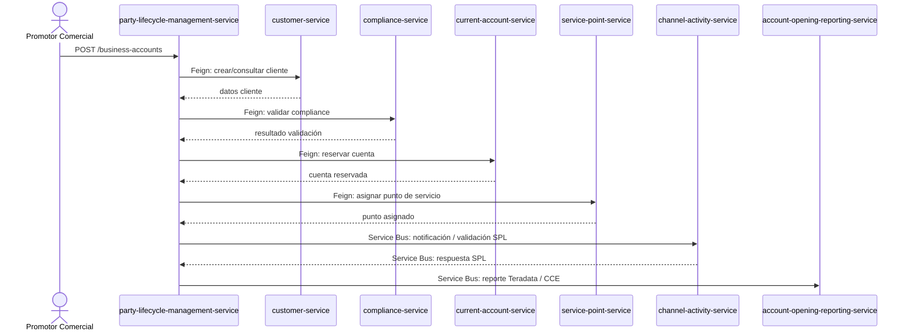

### 6.2 Flujo de Validación de Poderes SPL

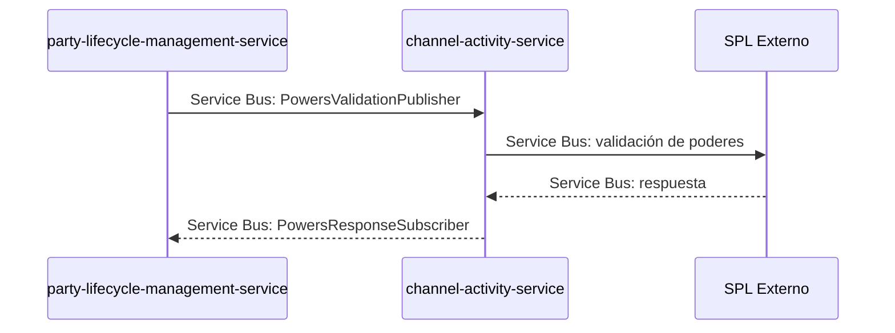

### 6.3 Flujo de Ingesta de Reportes Teradata

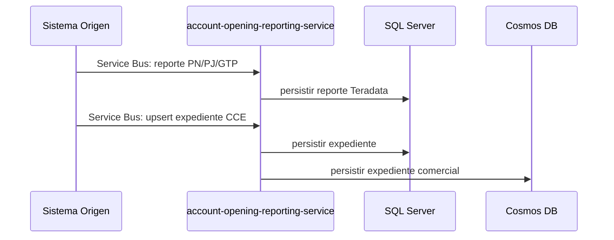

### 6.4 Flujo de Notificación al Cliente

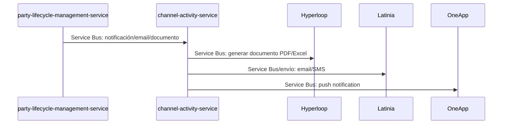

---

## 7. Inventario de Componentes Azure

| Recurso Azure | Servicios que lo usan | Uso |
|---------------|----------------------|-----|
| Azure Service Bus | Todos | Mensajería asíncrona entre servicios |
| Azure Key Vault | Todos | Secretos (connection strings, credenciales) |
| Azure Cosmos DB | `account-opening-reporting-service` | Expedientes comerciales (`AssiExpedient`) |
| Azure Blob Storage | `account-opening-reporting-service`, `channel-activity-service` | Templates y archivos generados |
| Azure Kubernetes Service | Todos | Plataforma de despliegue (namespace `bcv`) |
| Azure Managed Identity | `channel-activity-service` | Autenticación SPL sin connection string |
| Azure DevOps | Todos | CI/CD y pipelines |

---

## 8. Feature Flags Detectados

| Servicio | Feature Flag | Ubicación | Estado |
|----------|--------------|-----------|--------|
| `party-lifecycle-management-service` | `feature-flags.service-point-delete-user-enabled` | `FeatureFlagAdapter.java` | Activo |
| `customer-service` | `features.rm-customer.fake-apim.enabled` | `VerifyRegularizationRmUseCase.java` | Activo (default false) |
| `service-point-service` | `assi.businessaccount.flag.*` | `FlagProperties.java` | Legacy |

---

## 9. Matriz de Dependencias entre Servicios

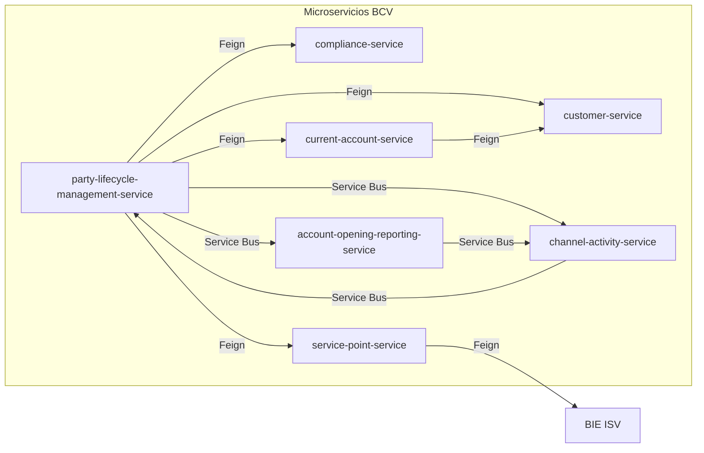

| Servicio | Entradas | Salidas |
|----------|----------|---------|
| `party-lifecycle-management-service` | REST, Service Bus (SPL response, data activa) | Feign a 4 servicios, Service Bus a CA/REP |
| `customer-service` | REST, Feign desde PLM/CURR | SQL Server |
| `compliance-service` | REST, Feign desde PLM | SQL Server, Feign a SUNAT/CCE/VCL |
| `current-account-service` | REST, Feign desde PLM | SQL Server, Feign a customer/IFX |
| `service-point-service` | REST, Feign desde PLM, Service Bus | SQL Server, Feign a BIE ISV, Service Bus |
| `channel-activity-service` | Service Bus desde PLM | Service Bus a PLM, Hyperloop, Latinia, SPL |
| `account-opening-reporting-service` | REST, Service Bus | SQL Server, Cosmos DB, Blob Storage, Service Bus |

---

## 10. Observaciones y Hallazgos Transversales

1. **Arquitectura heterogénea:** `service-point-service` es el único que no sigue el patrón hexagonal.
2. **Centro de gravedad:** `party-lifecycle-management-service` es el orquestador principal con más de 30 ports y adapters.
3. **Comunicación dominante:** Service Bus para flujos asíncronos; OpenFeign para consultas síncronas.
4. **Persistencia dual:** `account-opening-reporting-service` usa SQL Server + Cosmos DB.
5. **Procesador stateless:** `channel-activity-service` no tiene controllers REST ni persistencia propia.
6. **Seguridad:** Todos usan Azure Key Vault para secretos y JWT Bearer para APIs.
7. **Feature flags:** Implementados como propiedades Spring simples, sin plataforma dedicada.
8. **Tests:** `channel-activity-service` y `customer-service` tienen la mayor cobertura visible.
9. **Documentación:** `rest-api.yaml` vacíos en varios servicios.
10. **Quality gates:** SpotBugs/PMD en `skip=true` en varios repos.

---

## 11. Conclusiones

El ecosistema BCV es un conjunto de microservicios Java/Spring Boot fuertemente integrado, donde:

- **`party-lifecycle-management-service`** actúa como orquestador central del ciclo de vida del expediente.
- **`customer-service`**, **`compliance-service`**, **`current-account-service`** y **`service-point-service`** son servicios de dominio especializado invocados principalmente por PLM.
- **`channel-activity-service`** orquesta integraciones asíncronas con plataformas externas (SPL, Hyperloop, Latinia, OneApp).
- **`account-opening-reporting-service`** centraliza reportes y consultas, con persistencia dual SQL/Cosmos.

Las principales oportunidades de mejora son:
- Estandarizar la arquitectura de `service-point-service` hacia hexagonal.
- Completar y mantener los contratos OpenAPI (`rest-api.yaml`).
- Gestionar el ciclo de vida de los feature flags.
- Mejorar la cobertura de tests en todos los servicios.
- Generar documentación técnica automatizada y sincronizada.

---

**Documento generado:** 2026-08-14
**Autor:** Asistente de Análisis Técnico
**Scope:** Ecosistema de microservicios BCV en workspace local
