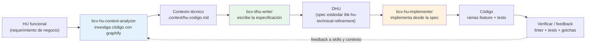
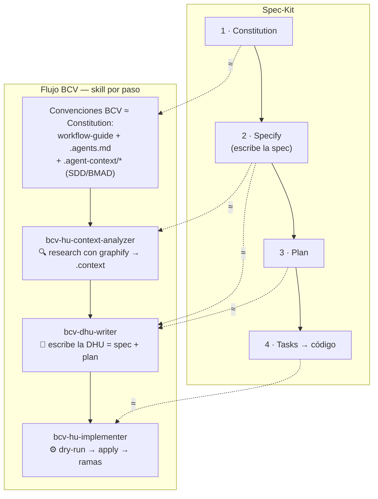
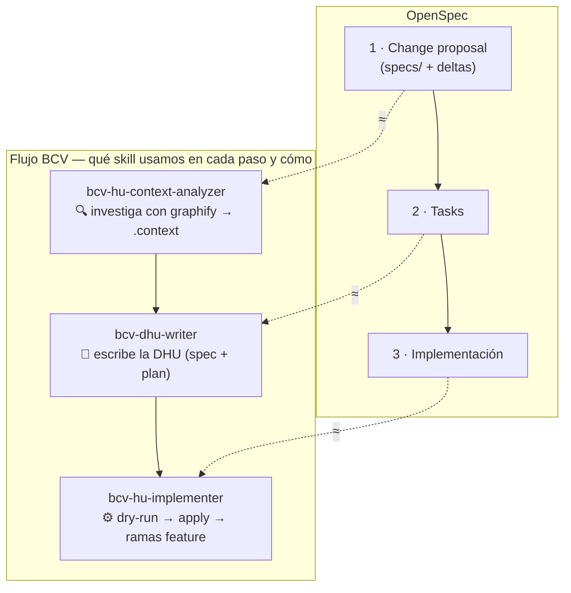

# Proyecto: Adaptación de Skills IA para el Ecosistema BCV/BACC — Interbank

> Documento de estado y roadmap del proyecto.
> Complementa a `docs/hu-dhu-workflow-guide.md` (flujo HU → DHU → código) y a `README.md` (catálogo de skills).

## 1. En qué consiste el proyecto

El proyecto consiste en **construir y adaptar un conjunto de skills de agente** (instrucciones especializadas para asistentes de código basados en IA, como GitHub Copilot) que permiten a un agente de IA **generar, mantener y diagnosticar** los microservicios backend del ecosistema **BCV/BACC** (Business Customer Value — Apertura de Cuentas Comerciales) de Interbank.

Estos skills codifican el conocimiento de dominio del ecosistema BACC:

- Convenciones de arquitectura (hexagonal/clean y layered legacy).
- Librerías internas (`ads-spring-boot-*`, `bcv-commons-*`).
- Integraciones (Azure Service Bus, OpenFeign, SQL Server, Cosmos DB, Key Vault).
- Observabilidad, testing y contratos OpenAPI.

El núcleo de valor es el **pipeline HU → DHU → código**, que convierte una Historia de Usuario (HU) de negocio en una Historia Técnica (DHU) detallada y, opcionalmente, en cambios de código, usando **graphify** como motor de análisis local de código para **minimizar el consumo de tokens** (~85 % menos frente a la radiografía con LLM puro).

**Referencia del flujo:** `docs/hu-dhu-workflow-guide.md`

### 1.1 Metodología: SDD + BMAD

El proyecto sigue **Spec-Driven Development (SDD)** y **BMAD** como metodologías de trabajo:

- **SDD** — la especificación (DHU) es el artefacto central y va **antes** del código.
- **BMAD** — `Understand → Design → Build → Validate` para la fase de construcción de cada cambio.

| Fase SDD | Acción del flujo BCV |
| --- | --- |
| Especificar (entrada) | HU funcional de negocio |
| Research-Driven Context | `bcv-hu-context-analyzer` investiga el código real con graphify → `.context/hu-<codigo>.md` |
| Especificar formalmente | `bcv-dhu-writer` escribe la DHU (criterios de aceptación, endpoints, mapa técnico) |
| Implementar desde la spec | `bcv-hu-implementer` aplica la DHU en ramas feature (dry-run / apply) |
| Verificar / feedback | Linter + tests, revisión humana y gotchas que vuelven al contexto |

#### Flujo visual (cómo SDD se aplica en BCV)

La metodología SDD nos pide *especificar primero, codificar después*. El flujo BCV lo implementa así, añadiendo **graphify** (motor de investigación local) para minimizar tokens:

> **Qué dice SDD y cómo lo cumplimos:** SDD exige que la especificación sea el artefacto central y vaya **antes** del código. En BCV la especificación es la **DHU** (template corporativo `ibk-hu-technical-refinement`), y el paso de *research* usa **graphify** (consulta el código real localmente, ~0 tokens de LLM) en lugar de que el LLM lea repositorios completos.

### 1.2 ¿Por qué no Spec-Kit ni OpenSpec?

Se evaluaron los frameworks SDD genéricos [Spec-Kit](https://github.com/github/spec-kit) y [OpenSpec](https://github.com/openspec) y se **descartaron a favor del flujo custom BCV** por:

1. **Alineación corporativa** — el DHU debe seguir el template `ibk-hu-technical-refinement` (estándar Interbank/BCV).
2. **Integración con graphify** — investigación local de código con ~0 tokens. Spec-Kit/OpenSpec **no integran graphify**: su investigación es el LLM leyendo archivos, lo que no logra el ahorro de ~85 %.
3. **Eficiencia de tokens** — contexto mínimo (`service-map.md`, `gotchas.md`) y consultas quirúrgicas.
4. **Multi-servicio** — BACC son 7 repos independientes con un workspace compartido; Spec-Kit/OpenSpec son repo-local.
5. **Control del pipeline** — gates propios (gaps, DoR/DoD, ramas `feature/HU-...` sin commit automático).
6. **Estamos sentando las bases** — el objetivo no es adoptar una herramienta genérica, sino construir una capa de skills y contexto propia del ecosistema BCV que luego pueda evolucionar y extenderse a otros servicios de Interbank.

| Aspecto | Flujo BCV (custom) | Spec-Kit / OpenSpec |
| --- | --- | --- |
| Formato de spec | DHU (`ibk-hu-technical-refinement`) | `spec.md` propio / `specs/` + deltas |
| Investigación de código | graphify (grafo local, ~0 tokens) | LLM lee archivos (no usa graphify) |
| Contexto multi-servicio | workspace + `service-map.md` + `gotchas.md` | repo-local |
| Alineación corporativa | Alta (BCV/BACC) | Baja (genérico) |
| Ahorro de tokens | ~85 % (con graphify) | No logra el mismo ahorro |

#### ¿En qué punto coincidimos con graphify? (paso a paso)

Todos los flujos SDD tienen un paso donde **se investiga el código existente** antes de especificar. BCV hace esa investigación con **graphify**; Spec-Kit y OpenSpec la hacen con el **LLM leyendo archivos** (más caro). Ese es el punto de coincidencia y de diferencia.

**Spec-Kit**

> **Nota:** en BCV, la **DHU extendida** (`bcv-dhu-writer`) agrupa la *spec* y el *plan* en un solo artefacto (CAs + plan de tareas + mapa técnico). Por eso *Specify* y *Plan* apuntan a `bcv-dhu-writer`; `bcv-hu-context-analyzer` es solo el research previo con graphify.

Paso a paso (Spec-Kit → cómo lo hace BCV):

1. **Constitution** — reglas/metodología del proyecto. BCV lo cubre con sus **convenciones estáticas**: `docs/hu-dhu-workflow-guide.md`, `.agents.md` / `.github/copilot-instructions.md` y `docs/.agent-context/*.md` (service-map, architecture-conventions, cross-service-patterns). Definen cómo se trabaja (SDD/BMAD, arquitectura, contexto) y no cambian por HU.
2. **Specify** — es el punto clave: para escribir la spec hay que entender el código. BCV lo hace en dos pasos: `bcv-hu-context-analyzer` investiga con **graphify** (~0 tokens → `.context`) y `bcv-dhu-writer` escribe la **DHU** (spec). Spec-Kit por defecto usa el LLM leyendo archivos.
3. **Plan** — BCV lo cubre con el **plan de tareas / mapa técnico** que `bcv-dhu-writer` incluye en la DHU extendida.
4. **Tasks → código** — BCV lo hace con `bcv-hu-implementer` en ramas `feature/HU-...`.

**OpenSpec**

Paso a paso (OpenSpec → cómo lo hace BCV):

1. **Change proposal** — proponer el cambio requiere analizar el código. BCV lo hace con `bcv-hu-context-analyzer` (graphify → `.context`) y `bcv-dhu-writer` escribe la propuesta como **DHU** (spec + plan).
2. **Tasks** — BCV lo cubre con el **plan de tareas / mapa técnico** que `bcv-dhu-writer` genera en la DHU, y `bcv-hu-implementer` lo ejecuta.
3. **Implementación** — BCV lo hace con `bcv-hu-implementer` (dry-run → apply).

> **Conclusión:** en el punto donde todos deben *entender el código*, BCV usa **graphify** (grafo local, ~0 tokens, reutilizable entre HUs). Spec-Kit y OpenSpec dependen del LLM leyendo archivos en cada ejecución → no logran el ahorro de ~85 %.

### 1.3 Ahorro de tokens

| Escenario | Tokens estimados por HU |
| --- | --- |
| **Con skills + graphify** | **~8.000 – 12.000** |
| Con skills, sin graphify | ~25.000 – 45.000 |
| Sin skills ni graphify | ~50.000 – 90.000 |

**Ahorro vs LLM puro: ~85 % menos.** Para la HU de ejemplo "Agregar oficina registral en canal BCW": ~10.000 tokens con skills + graphify, frente a ~33.000 sin graphify y ~70.000 sin skills ni graphify.

## 2. Alcance del proyecto

### 2.1 Incluido

- **7 microservicios backend BACC** (Java 21 / Spring Boot 3.x, hexagonal, Azure Service Bus, SQL Server + Cosmos DB, OpenFeign, Key Vault):

  | Servicio | Arquitectura |
  | --- | --- |
  | `party-lifecycle-management-service` | Hexagonal |
  | `channel-activity-service` | Hexagonal |
  | `compliance-service` | Hexagonal |
  | `current-account-service` | Hexagonal |
  | `customer-service` | Hexagonal |
  | `account-opening-reporting-service` | Hexagonal |
  | `service-point-service` | Layered (legacy) |

- **13 skills de agente**, divididos en dos grupos:
  - **Pipeline (3):** `bcv-hu-context-analyzer`, `bcv-dhu-writer`, `bcv-hu-implementer`.
  - **Implementación (10):** `bcv-hexagonal-architecture`, `bcv-clean-architecture`, `bcv-java-spring-boot`, `bcv-openapi-design`, `bcv-openfeign`, `bcv-azure-service-bus`, `bcv-spring-data-jpa-sql-server`, `bcv-cosmos-db`, `bcv-commons-observability`, `bcv-testing`.

- **Flujo completo HU → DHU → implementación**, incluyendo:
  - Investigación de código con graphify (local, ~0 tokens).
  - Contexto mínimo versionado (`service-map.md`, `architecture-conventions.md`, `cross-service-patterns.md`, `gotchas.md` por servicio).

### 2.2 Excluido

- Frontend, pantallas, componentes UI y lógica de presentación.
- Análisis de repositorios no BACC.
- Radiografía de código con LLM (se usa graphify + lecturas puntuales).

### 2.3 Duración

- **Inicio:** 13 de agosto de 2026.
- **Fin:** 09 de octubre de 2026 (~8 semanas).
- **Disponibilidad del equipo:**
  - **Jose Luis Mejia Rojas** — hasta el 10 de septiembre de 2026.
  - **Oscar Fabian Castro Severino** — hasta el 09 de octubre de 2026.

## 3. Equipo de trabajo (responsabilidades)

| Nombre | Rol | Disponibilidad | Responsabilidades |
| --- | --- | --- | --- |
| **Jose Luis Mejia Rojas** | Arquitecto IA | 13 ago – 10 sep 2026 | Definición de la arquitectura de la solución de skills y del flujo HU → DHU. Decisiones de contexto y adopción de graphify. Diseño del workspace y las convenciones cross-service. Validación de DHUs y criterios de calidad. Interacción con el cliente (acuerdos de alcance y entrega de HU de negocio). *(detalle por confirmar)* |
| **Oscar Fabian Castro Severino** | Ingeniero IA | 13 ago – 09 oct 2026 | Implementación y refinamiento de los skills. Generación y mantenimiento de grafos graphify. Ejecución del pipeline (análisis de HU, generación de DHU, implementación). Pruebas, reportes de implementación y actualización de gotchas/contexto. *(detalle por confirmar)* |

> **Nota:** las responsabilidades detalladas son una propuesta basada en los roles de la sección 16 del workflow guide (Context owner, Service owner, HU analyst, Validator, Implementer). Se ajustan según lo que validemos.

### 3.1 Colaboración con el equipo dev del banco

El **equipo de desarrollo del banco** es la contraparte que valida en la práctica: dispone del entorno en su propia PC y ejecuta **iteraciones con feedback** sobre los skills, reportando correcciones y ajustes que vuelven al equipo IA para refinar la solución. Este ciclo de feedback es la vía principal de validación de calidad de los skills durante las semanas restantes.

| Nombre | Rol |
| --- | --- |
| Sergio Manuel | Líder técnico |
| Lionel Gonzales | Desarrollador |
| Fernando Camargo | Desarrollador |
| Jose Peramas | Desarrollador |

## 4. Roadmap del proyecto

**Duración total:** 13 de agosto → 09 de octubre de 2026 (~8 semanas).

| Semana | Fechas | Estado | Hito | Detalle / Entregable |
| --- | --- | --- | --- | --- |
| **1** | 13 – 19 ago | ✅ Completada | Consolidación de repositorios + entorno | Se consolidó toda la información de los repos a trabajar (los 7 microservicios BACC) y se configuró el entorno. |
| **2** | 20 – 26 ago | ✅ Completada | Optimización de tokens → graphify y creación de skills del pipeline | Junto con algunos días de la semana 1, se evaluó la optimización de tokens y se concluyó adoptar **graphify** como mecanismo de ahorro, con el flujo de workspace documentado en `docs/hu-dhu-workflow-guide.md`. Se crearon los skills del pipeline: **`bcv-hu-context-analyzer`**, **`bcv-dhu-writer`** y **`bcv-hu-implementer`**. Adicionalmente, se acordó con el cliente la entrega de una **HU de negocio** que, con contexto de graphify, permitirá elaborar un plan de implementación y crear la **HU técnica (DHU)**. |
| **3** | 27 ago – 02 sep | 🔄 En curso | Primer ejercicio HU → DHU → código | Se completó un primer ejercicio completo de negocio a código: a partir de una **HU de negocio** se generó la **HU técnica (DHU)**, se implementó en código y se subió al ambiente de **desarrollo**. Validación/prueba en curso con **Fernando Camargo** (equipo dev del banco). |
| **4** | 03 – 09 sep | ⬜ Propuesto | Iteración de skills + HU de negocio | Continuar mejorando los skills con código real. En paralelo, recepción de la HU de negocio del cliente y arranque del análisis con `bcv-hu-context-analyzer` (graphify) → `.context/hu-<codigo>.md`. |
| **5** | 10 – 16 sep | ⬜ Propuesto | Iteración + DHU | Seguir refinando skills según feedback. Generar la DHU técnica (`bcv-dhu-writer`) y resolver dudas pendientes con el cliente. |
| **6** | 17 – 23 sep | ⬜ Propuesto | Iteración + implementación | Continuar la mejora de skills. Ejecutar `bcv-hu-implementer` (dry-run → apply) sobre la HU: ramas `feature/HU-...` y reporte de implementación. |
| **7** | 24 – 30 sep | ⬜ Propuesto | Validación con equipo dev del banco | El **equipo dev del banco prueba en su propio entorno (PC)** y devuelve feedback para corregir los skills. Ciclo de corrección: ajustar skills, regenerar y revalidar. |
| **8** | 01 – 07 oct | ⬜ Propuesto | Estabilización y cierre | Estabilización final de los skills con el feedback consolidado, documentación/onboarding, demo con el cliente y lecciones aprendidas. |
| **Cierre** | 08 – 09 oct | ⬜ Propuesto | Cierre de entregables | Cierre final y traspaso a cargo de **Oscar** (Jose Luis finalizó el 10 sep). |

> **Actualización de grafos graphify:** se regeneran (`graphify <repo> --code-only`) cuando un feat implica un **cambio estructural grande** (nuevos controllers, entidades, integraciones o refactors de paquetes). El skill `bcv-hu-implementer` lo indica en el reporte de implementación, o el equipo decide a criterio al finalizar el sprint.

### 4.1 Hitos de disponibilidad

- **10 sep 2026** — Jose Luis Mejia Rojas finaliza su participación. Su trabajo queda **culminado y traspasado** en esta fecha. A partir de aquí, **Oscar** queda como único recurso, en rol de **soporte y afinaciones** finales.
- **09 oct 2026** — Oscar Fabian Castro Severino finaliza su participación; cierre del proyecto.

> **Semana 3 en adelante:** la constante de las semanas 4–8 es la **iteración continua sobre los skills**: se mejora con código real y, a partir de la semana 7, el **equipo dev del banco prueba en su entorno (PC)** y devuelve feedback que se traduce en correcciones. El flujo HU → DHU corre en paralelo como validación del pipeline, no como único foco.

---

## Supuestos y consultas abiertas

Para afinar el documento, dejo marcados los puntos que conviene validar:

1. **Responsabilidades del equipo** — Propuse un desglose por rol (Arquitecto IA / Ingeniero IA). ¿Quieres ajustar o complementar alguna responsabilidad?
2. **Hitos de las semanas 4–8** — Ajusté el roadmap para reflejar la iteración continua de skills con feedback del equipo dev del banco. ¿Hay hitos reales ya pactados (entrega de la HU de negocio, sprint de validación, demo) que deba fijar en una semana concreta?
