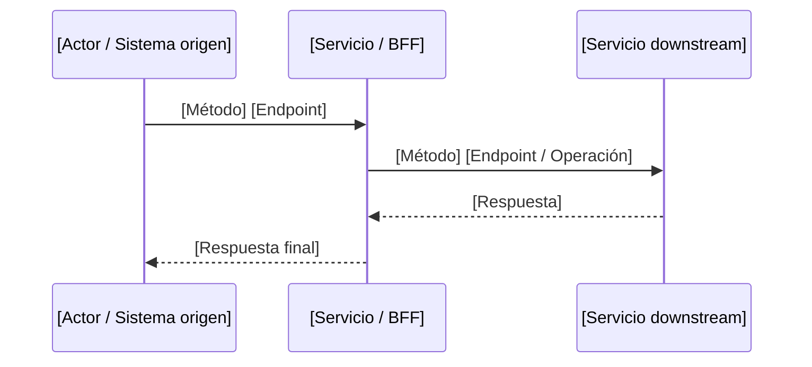

# [HU | DHU | Doc. Funcional] — [Nombre de la funcionalidad]

## Descripción breve

[2-5 líneas de contexto. Explicar qué se va a construir o modificar y por qué.]

## ¿Cuál es la necesidad?

[Problema o vacío puntual que esta iniciativa resuelve. Contexto de negocio y usuario.]

## Narrativa (HU)

**Yo como** [rol del actor]  
**Quiero** [acción o capacidad deseada]  
**Para que** [beneficio o valor que obtiene]

## Diagrama de flujo TO BE



## Reglas de Negocio

| # | Regla | Descripción |
|---|-------|-------------|
| RN-01 | [Nombre regla] | [Descripción concreta, validaciones, códigos de error] |

## Contratos de entrada y salida

### [MÉTODO] [Endpoint]

| Campo | Ubicación | Tipo | Obligatorio | Validación |
|-------|-----------|------|-------------|------------|
| ...   | ...       | ...  | ...         | ...        |

**Respuesta exitosa (HTTP [código]):**

```json
{
  "...": "..."
}
```

**Respuesta de error (HTTP [código]):**

```json
{
  "error": "ERROR_CODE",
  "message": "..."
}
```

## Criterios de Aceptación

### CA 01 — [Título del criterio]

Dado [precondición], cuando [acción], entonces [resultado esperado verificable].

### CA 02 — [Título del criterio]

...

## Endpoints nuevos / modificados

| Método | Endpoint | Descripción |
|--------|----------|-------------|
| GET    | /api/v1/... | ... |

## Dependencias

| Servicio | Tipo | Descripción |
|----------|------|-------------|
| ...      | ...  | ... |

## Fuera del Alcance

- [Ítem 1]
- [Ítem 2]

## Estimación

| Campo | Valor |
|-------|-------|
| Story Points | [n] |
| Sprint | [Sprint YYYY-NN] |

## Control de Versiones

| Versión | Descripción | Fecha | Responsable | Estado |
|---------|-------------|-------|-------------|--------|
| 1.0 | [Descripción inicial] | DD/MM/YYYY | [Nombre] | EN ELABORACIÓN |

---

## Anexo técnico (generado por el pipeline)

> Este anexo es información técnica derivada del análisis de impacto. Los artefactos completos se encuentran en:
> - `docs/historial/<hu-slug>-technical-impact-analysis.yaml`
> - `docs/historial/<hu-slug>-technical-story-enriched.md`
> - `docs/historial/<hu-slug>-technical-implementation-blueprint.yaml`

### Servicios impactados

- **Primary service:**
- **Supporting services:**

### Archivos afectados

- `path/to/file` (create | modify | delete) — descripción del cambio

### Tareas técnicas (IMP-XXX)

| Tarea | Tipo | Servicio | Skill | Estado |
|-------|------|----------|-------|--------|
| IMP-001 | ... | ... | ... | TODO |

### Preguntas abiertas

| # | Pregunta | Bloqueante | Fallback |
|---|----------|------------|----------|
| 1 | ... | Sí/No | ... |
