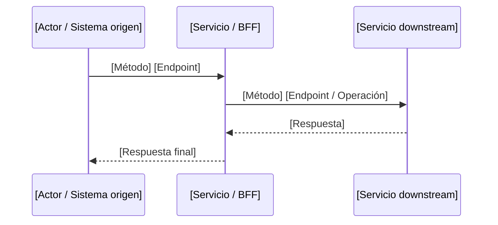
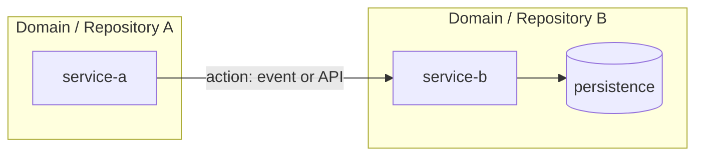

# [HU | DHU | Doc. Funcional] — [Nombre de la funcionalidad]

> **Versión:** 1.0.0  
> **Fecha:** DD/MM/YYYY  
> **Estado:** EN ELABORACIÓN | EN REVISIÓN | APROBADO | FINALIZADO | OBSOLETO  
> **HU Slug:** `<hu-slug>`  
> **Technical status:** READY | REVIEW_REQUIRED | BLOCKED

---

## Items pendientes de clarificación

> **Regla:** Si esta sección contiene ítems bloqueantes, el documento debe permanecer en estado `EN REVISIÓN` y no puede pasar a implementación hasta que se resuelvan.

| # | Ítem / Pregunta | Bloqueante | Impacto si no se resuelve | Responsable de aclarar | Estado |
|---|-----------------|------------|---------------------------|------------------------|--------|
| 1 |                 | Sí / No    |                           |                        | Pendiente |

Si no hay ítems pendientes, escribir: **Sin ítems pendientes.**

---

## Descripción breve

[2-5 líneas de contexto. Explicar qué se va a construir o modificar y por qué.]

## ¿Cuál es la necesidad?

[Problema o vacío puntual que esta iniciativa resuelve. Contexto de negocio y usuario.]

## Narrativa (HU)

**Yo como** [rol del actor]  
**Quiero** [acción o capacidad deseada]  
**Para que** [beneficio o valor que obtiene]

## Diagrama de flujo TO BE



## Reglas de Negocio

| # | Regla | Descripción |
|---|-------|-------------|
| RN-01 | [Nombre regla] | [Descripción concreta, validaciones, códigos de error] |

## Contratos de entrada y salida

### [MÉTODO] [Endpoint]

| Campo | Ubicación | Tipo | Obligatorio | Validación |
|-------|-----------|------|-------------|------------|
| ...   | ...       | ...  | ...         | ...        |

**Respuesta exitosa (HTTP [código]):**

```json
{
  "...": "..."
}
```

**Respuesta de error (HTTP [código]):**

```json
{
  "error": "ERROR_CODE",
  "message": "..."
}
```

## Criterios de Aceptación

### CA 01 — [Título del criterio]

Dado [precondición], cuando [acción], entonces [resultado esperado verificable].

### CA 02 — [Título del criterio]

...

## Endpoints nuevos / modificados

| Método | Endpoint | Descripción |
|--------|----------|-------------|
| GET    | /api/v1/... | ... |

## Dependencias

| Servicio | Tipo | Descripción |
|----------|------|-------------|
| ...      | ...  | ... |

## Fuera del Alcance

- [Ítem 1]
- [Ítem 2]

## Estimación

| Campo | Valor |
|-------|-------|
| Story Points | [n] |
| Sprint | [Sprint YYYY-NN] |

## Control de Versiones

| Versión | Descripción | Fecha | Responsable | Estado |
|---------|-------------|-------|-------------|--------|
| 1.0 | [Descripción inicial] | DD/MM/YYYY | [Nombre] | EN ELABORACIÓN |

---

---

## Anexo técnico

Este DHU es un documento autocontenido. La siguiente información técnica se deriva del análisis de impacto y se incluye completa aquí para no depender de archivos externos.

### 13. Servicios impactados

- **Primary service:** [nombre del servicio principal y rol]
- **Supporting services:**
  - [nombre] — [rol: data_owner, orchestrator, integration_adapter, participant]

### 14. Matriz de impacto técnico

#### APIs

- **Confirmed:**
  - `[servicio] [MÉTODO] [path]` — [descripción]
- **Candidate:**
  - `[servicio] [MÉTODO] [path]` — [descripción, pendiente de confirmar]

#### Persistencia

- **Confirmed:**
  - `[servicio] [entidad/tabla]` — [cambio]
- **Candidate:**
  - `[servicio] [entidad/tabla]` — [descripción, pendiente de confirmar]

#### Eventos e integraciones

- **Confirmed:**
  - `[evento]` — publisher: [servicio], consumer: [servicio]
- **Candidate:**
  - `[evento]` — [descripción, pendiente de confirmar]

### 15. Plan de tareas técnicas

#### IMP-000: [Resolver ambigüedades / discovery] (si aplica)

- **Tipo:** discovery
- **Estado:** TODO | BLOCKED
- **Descripción:** [qué se debe resolver]
- **Opciones de resolución:**
  - **Opción A:** [decisión concreta]
  - **Opción B:** [alternativa]
  - **Opción C (fallback):** [acción conservadora]
- **Impacto si no se resuelve:** [tareas bloqueadas]

#### IMP-001: [Título de la tarea]

- **Servicio:** [nombre]
- **Tipo:** contract | domain | persistence | messaging | observability | testing
- **Skill recomendado:** [skill o categoría]
- **Estado:** TODO | BLOCKED
- **Descripción:** [qué se debe hacer]
- **Criterios de aceptación técnicos:**
  - [criterio 1]
  - [criterio 2]
- **Archivos afectados:**
  - `path/to/file` (create | modify | delete) — [descripción del cambio]
- **Dependencias:** [IMP-XXX]
- **Condición de desbloqueo:** (solo si BLOCKED)

### 16. Diagrama de arquitectura de implementación



### 17. Riesgos y supuestos

- **ASSUMED:** [supuesto]
- **RISK:** [riesgo]

### 18. Archivos del repositorio a crear / modificar / eliminar

#### Crear

- `path/to/new/file.ext` — [propósito y servicio]

#### Modificar

- `path/to/existing/file.ext` — [descripción del cambio y servicio]

#### Eliminar

- `path/to/obsolete/file.ext` — [razón]

### 19. Dominios / entidades afectados

- `DomainName` / `EntityName` — [impacto]

### 20. Migraciones / configuración

- **Migración:** `path/to/migration.sql` — [propósito]
- **Configuración:** `path/to/config.yml` — [cambio]

### 21. Preguntas abiertas / aclaraciones pendientes

| # | Pregunta | Bloqueante | Fallback si no se aclara |
|---|----------|------------|--------------------------|
| 1 | ... | Sí/No | ... |

### 22. Revisión y aprobación técnica

- [ ] El plan cubre todos los criterios de aceptación de la HU.
- [ ] Cada tarea es entendible y ejecutable sin inventar requisitos.
- [ ] Las dependencias y estados BLOCKED son correctos.
- [ ] Cada tarea BLOCKED tiene una condición de desbloqueo clara.
- [ ] Se cubren escenarios de error y casos límite.
- [ ] Las decisiones técnicas son razonables y están documentadas.
- [ ] Los archivos del repositorio a crear/modificar/eliminar están identificados.
- [ ] No falta configuración, migración o documentación.

**Reviewer:** _________________  
**Date:** _________________  
**Approved:** [ ] Sí  [ ] No — comentarios:
