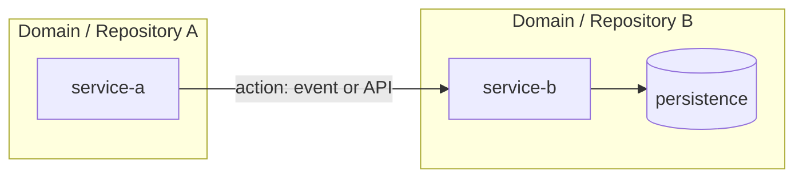

# [HU | DHU | Doc. Funcional] Técnico — [Nombre de la funcionalidad]

> **Versión:** 1.0.0  
> **Fecha:** DD/MM/YYYY  
> **Estado:** EN ELABORACIÓN | EN REVISIÓN | APROBADO | FINALIZADO | OBSOLETO  
> **HU Slug:** `<hu-slug>`  
> **Technical status:** READY | REVIEW_REQUIRED | BLOCKED  
> **Source impact analysis:** `docs/historial/<hu-slug>-technical-impact-analysis.yaml`

---

## 1. Alcance

[Delimitación del alcance funcional y técnico de la iniciativa.]

## 2. Descripción breve

[2-5 líneas de contexto sin tecnicismos excesivos.]

## 3. ¿Cuál es la necesidad?

[Problema o vacío puntual que esta iniciativa resuelve, desde la perspectiva de negocio.]

## 4. Historias de Usuario

### HU 01 — [Título de la HU]

Yo como [rol del actor]  
Quiero [acción o capacidad deseada]  
Para [beneficio o valor que obtiene]

## 5. Criterios de Aceptación

**CA 01** — [Descripción de un comportamiento verificable, observable y medible]

**CA 02** — [Descripción de un comportamiento verificable, observable y medible]

**CA 03** — [Descripción de un comportamiento verificable, observable y medible]

## 6. Diagrama de flujo TO BE

[Imagen, enlace o diagrama Mermaid del flujo funcional.]

## 7. Referencias

- Resolución funcional: `docs/historial/<hu-slug>-business-resolution.yaml`
- Matriz de impacto técnico: `docs/historial/<hu-slug>-technical-impact-analysis.yaml`
- Historia técnica enriquecida: `docs/historial/<hu-slug>-technical-story-enriched.md`
- Blueprint de implementación: `docs/historial/<hu-slug>-technical-implementation-blueprint.yaml`
- Figma: [link]
- Example Mapping: [link]
- Arquitectura: [link]

---

## 8. Resumen técnico

### 8.1 Servicios impactados

- **Primary service:**
- **Supporting services:**
- **Decision rationale:**

### 8.2 Matriz de impacto técnico

#### APIs

- Confirmed:
- Candidate:

#### Persistencia

- Confirmed:
- Candidate:

#### Eventos e integraciones

- Confirmed:
- Candidate:

## 9. Plan de tareas técnicas

[Resumen de tareas IMP-XXX con estado, dependencias y skill asignado.]

## 10. Diagrama de arquitectura de implementación

## 11. Riesgos y supuestos

- ASSUMED:
- RISK:

## 12. Glosario de términos técnicos

| Término | Definición |
|---------|-----------|
| [Término] | [Definición] |

## 13. Control de Versiones

| Versión | Descripción | Fecha | Responsable | Estado |
|---------|-------------|-------|-------------|--------|
| 1.0 | Versión inicial | DD/MM/YYYY | [Nombre] | EN ELABORACIÓN |

## 14. Revisión y aprobación técnica

- [ ] El plan cubre todos los criterios de aceptación de la HU.
- [ ] Cada tarea es entendible y ejecutable sin inventar requisitos.
- [ ] Las dependencias y estados BLOCKED son correctos.
- [ ] Cada tarea BLOCKED tiene una condición de desbloqueo clara.
- [ ] Se cubren escenarios de error y casos límite.
- [ ] Las decisiones técnicas son razonables y están documentadas.
- [ ] Los archivos del repositorio a crear/modificar/eliminar están identificados.
- [ ] No falta configuración, migración o documentación.

**Reviewer:** _________________  
**Date:** _________________  
**Approved:** [ ] Sí  [ ] No — comentarios:
