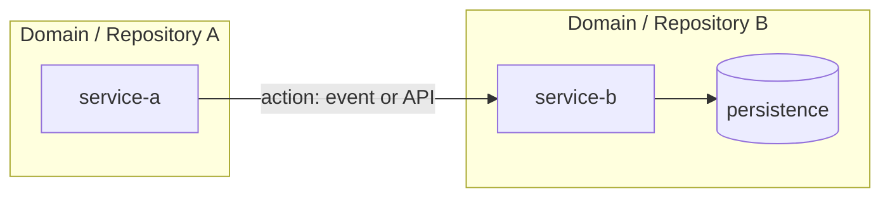

# Technical Story Enriched

> Source impact analysis: `docs/historial/<hu-slug>-technical-impact-analysis.yaml`
> Technical status consumed: READY | REVIEW_REQUIRED

<!-- Include this block only when the gate is REVIEW_REQUIRED. Keep it at the top. -->
## 0. Pending Architecture Review

- Open conflicts:
- Candidate-only impacts blocking a final decision:
- Required external validation:

## 1. Functional Context Summary

- HU/HAB summary:
- Acceptance criteria:
- In scope:
- Out of scope:

## 2. Impacted Services Decision

- Primary service:
- Supporting services:
- Decision rationale (evidence reference in the YAML):
- Deviations from the impact analysis (must be empty or justified):

## 3. Technical Impact Matrix

### 3.1 APIs

- Confirmed:
- Candidate:

### 3.2 Persistence

- Confirmed:
- Candidate:

### 3.3 Events and Integrations

- Confirmed:
- Candidate:

## 4. Technical Task Plan

Decompose the implementation work into numbered, traceable tasks derived from the impact matrix.
Each task must link to at least one HU acceptance criterion and one impact item from the YAML.
Do not include estimates, assignments or code snippets.

If the source business resolution contains ambiguities, start the plan with `IMP-000` to resolve
those ambiguities before the technical tasks that depend on them.

### IMP-000: Resolve inherited business-resolution ambiguities (optional)

- **Service:**
- **Type:** domain
- **Description:**
- **HU traceability:**
- **Impact traceability:** ambiguity item from business-resolution.yaml
- **Dependencies:**
- **Status:** TODO

### IMP-001: <Task title>

- **Service:** primary or supporting service responsible for the task
- **Type:** contract | domain | persistence | observability | testing
- **Description:** what must be done and why
- **HU traceability:** acceptance criterion or business rule covered
- **Impact traceability:** impacted_apis / impacted_persistence / impacted_events item
- **Dependencies:** other task IDs or external validations required
- **Status:** TODO

### IMP-002: <Task title>

- **Service:**
- **Type:**
- **Description:**
- **HU traceability:**
- **Impact traceability:**
- **Dependencies:**
- **Status:** TODO

## 5. Risks and Assumptions

- ASSUMED:
- RISK:

## 6. Validation Checklist

- [ ] Coverage of HU rules and acceptance criteria
- [ ] Non-regression checks defined
- [ ] HU -> HT -> tasks traceability complete
- [ ] Confirmed vs candidate split is explicit
- [ ] Every technical item traces back to the source impact analysis
- [ ] Every task links to at least one HU criterion and one impact item
- [ ] Architecture diagram reflects services, APIs, events and persistence from the impact matrix
- [ ] Open review items identified (if any)

## 7. Implementation Architecture Diagram

Render the technical impact matrix as a Mermaid diagram.
Use subgraphs for repositories or domains, nodes for microservices, arrows for APIs and events,
and cylinders for persistence. Mark candidate items with dashed lines or `(candidate)` labels.

Also write the diagram source to `docs/historial/<hu-slug>-technical-architecture-diagram.mmd`
so it can be reused in wikis, PRs or documentation.

