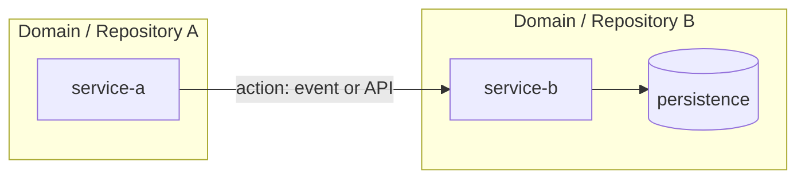

# Technical Story Enriched

> Source impact analysis: `docs/historial/<hu-slug>-technical-impact-analysis.yaml`
> Technical status consumed: READY | REVIEW_REQUIRED

<!-- Include this block only when the gate is REVIEW_REQUIRED. Keep it at the top. -->
## 0. Pending Architecture Review

- Open conflicts:
- Inherited ambiguities from business resolution:
- Candidate-only impacts blocking a final decision:
- Required external validation:
- Discovery tasks (IMP-000) blocking technical implementation:

## 1. Functional Context Summary

- HU/HAB summary:
- Acceptance criteria:
- In scope:
- Out of scope:

## 2. Impacted Services Decision

- Primary service:
- Supporting services:
- Decision rationale (evidence reference in the YAML):
- Deviations from the impact analysis (must be empty or justified):

## 3. Technical Impact Matrix

### 3.1 APIs

- Confirmed:
- Candidate:

### 3.2 Persistence

- Confirmed:
- Candidate:

### 3.3 Events and Integrations

- Confirmed:
- Candidate:

## 4. Technical Task Plan

Decompose the implementation work into numbered, traceable tasks derived from the impact matrix.
Each task must link to at least one HU acceptance criterion and one impact item from the YAML.
Do not include estimates, assignments or code snippets.

If the source business resolution contains ambiguities or the impact analysis detects conflicts,
start the plan with `IMP-000` to resolve those uncertainties before the technical tasks that depend on them.
Tasks that cannot advance until an ambiguity is resolved must use `Status: BLOCKED` and list the
unblock condition.

### IMP-000: Resolver ambigüedades y conflictos heredados (Discovery)

- **Service:** arquitectura / equipo de negocio / servicios candidatos
- **Type:** discovery
- **Recommended skill category:** `hu-analysis` (map to the user's HU/impact-analysis skill)
- **Description:** Investigar y resolver las ambigüedades del `business-resolution.yaml` y los conflictos técnicos detectados en el impact analysis antes de ejecutar tareas dependientes.
- **Step-by-step implementation:**
  1. List inherited ambiguities from `business-resolution.yaml`.
  2. Identify conflicts discovered during Phase A.
  3. Determine required clarifications and owners.
  4. Document unblock conditions for dependent tasks.
  5. Update `technical-impact-analysis.yaml` with confirmed evidence.
- **Inherited ambiguities / conflicts:**
  - [Descripción] → [Acción requerida] → [Owner sugerido]
- **Clarification questions:**
  - [Pregunta 1]
  - [Pregunta 2]
- **Suggested resolution options:**
  - **Option A:** [decisión concreta y artefacto esperado]
  - **Option B:** [alternativa plausible]
  - **Option C (fallback):** [acción conservadora si no hay consenso]
- **Impact if unresolved:**
  - [Lista de tareas bloqueadas: IMP-XXX, IMP-YYY]
- **Unblock condition:**
  - Cada ambigüedad está resuelta, aceptada como riesgo controlado o documentada como escenario alternativo.
- **HU traceability:**
- **Impact traceability:** inherited_ambiguities + conflicts
- **Dependencies:**
- **Status:** TODO

### IMP-001: <Task title>

- **Service:** primary or supporting service responsible for the task
- **Type:** contract | domain | persistence | observability | testing
- **Recommended skill category:** see `references/skill-mapping.md` (map to user's available skill)
- **Description:** what must be done and why
- **HU traceability:** acceptance criterion or business rule covered
- **Impact traceability:** impacted_apis / impacted_persistence / impacted_events item
- **Dependencies:** other task IDs or external validations required
- **Unblock condition:** (only if Status is BLOCKED)
- **Status:** TODO | BLOCKED

### IMP-002: <Task title>

- **Service:**
- **Type:**
- **Recommended skill(s):**
- **Description:**
- **HU traceability:**
- **Impact traceability:**
- **Dependencies:**
- **Unblock condition:**
- **Status:** TODO | BLOCKED

## 5. Risks and Assumptions

- ASSUMED:
- RISK:

## 6. Validation Checklist

- [ ] Coverage of HU rules and acceptance criteria
- [ ] Non-regression checks defined
- [ ] HU -> HT -> tasks traceability complete
- [ ] Confirmed vs candidate split is explicit
- [ ] Every technical item traces back to the source impact analysis
- [ ] Every task links to at least one HU criterion and one impact item
- [ ] Architecture diagram reflects services, APIs, events and persistence from the impact matrix
- [ ] Open review items identified (if any)

## 7. Implementation Architecture Diagram

Render the technical impact matrix as a Mermaid diagram.
Use subgraphs for repositories or domains, nodes for microservices, arrows for APIs and events,
and cylinders for persistence. Mark candidate items with dashed lines or `(candidate)` labels.

Also write the diagram source to `docs/historial/<hu-slug>-technical-architecture-diagram.mmd`
so it can be reused in wikis, PRs or documentation.

## 8. Detailed Action Plan

For each numbered task in the technical task plan, define the readiness, completion, testing,
error handling, dependencies and deployment considerations.
Do not include estimates, assignments or code snippets.

### IMP-000: <Task title>

- **Recommended skill category:** `hu-analysis` (map to the user's HU/impact-analysis skill)
- **Definition of Ready (DoR):
  - Prerequisites that must be satisfied before starting this task.
- **Definition of Done (DoD):**
  - Conditions that must be met to consider this task complete.
- **Technical acceptance criteria:**
  - Specific, verifiable criteria for this task.
- **Test cases:**
  - Happy path, edge cases and error scenarios.
- **Error scenarios:**
  - Expected failures, retry policies, fallback behavior.
- **External dependencies:**
  - Access, approvals, third-party systems, environment availability.
- **Deployment considerations:**
  - Order of deployment, feature flags, rollback strategy, monitoring.
- **Files affected:**
  - `path/to/file` (create | modify | delete) — reason
- **Security / compliance notes:**
  - PII, audit, encryption, data retention considerations.

### IMP-001: <Task title>

- **Recommended skill category:** see `references/skill-mapping.md` (map to user's available skill)
- **Step-by-step implementation:**
  1. First concrete step.
  2. Second concrete step.
  3. Third concrete step.
- **Definition of Ready (DoR):**
- **Definition of Done (DoD):**
- **Technical acceptance criteria:**
- **Test cases:**
- **Error scenarios:**
- **External dependencies:**
- **Deployment considerations:**
- **Files affected:**
- **Security / compliance notes:**

## 10. Repository File Impact

List the concrete files in the repository that must be created, modified or deleted.
Derive this list from `impacted_files` in the source impact analysis.
Mark candidate files explicitly.

### Files to create

- `path/to/new/file.ext` — purpose and owning service

### Files to modify

- `path/to/existing/file.ext` — change description and owning service

### Files to delete

- `path/to/obsolete/file.ext` — reason

### Domains / entities affected

- `DomainName` / `EntityName` — impact description

### Migrations / configuration

- Migration file: `path/to/migration.sql` — purpose
- Configuration: `path/to/config.yml` — change

## 11. Developer Review & Sign-off

Use this section for a developer to validate the plan before execution.

- [ ] The plan covers all HU acceptance criteria.
- [ ] Every task is understandable and executable without inventing requirements.
- [ ] Task dependencies and BLOCKED statuses are correct.
- [ ] Every BLOCKED task has a clear unblock condition.
- [ ] Error scenarios and edge cases are covered.
- [ ] Technical decisions are reasonable and documented.
- [ ] Repository files to create/modify/delete are identified.
- [ ] No missing configuration, migration or documentation is evident.

**Reviewer:** _________________  
**Date:** _________________  
**Approved:** [ ] Sí  [ ] No — comentarios:

## 12. Open Questions / Clarifications Needed

List any remaining indication, suspicion or missing clarification discovered while building this story.
If a question is blocking, it must be reflected in `IMP-000` or in `technical-impact-analysis.yaml`.

These questions are asked **one at a time in the chat response**. The assistant waits for each answer before asking the next one. Once all are answered, the assistant updates this story and the impact analysis.

| # | Question | Blocking | Proposed fallback if not clarified |
|---|----------|----------|------------------------------------|
| 1 |          | yes/no   |                                    |

**User confirmation:** _________________  
**Date:** _________________
