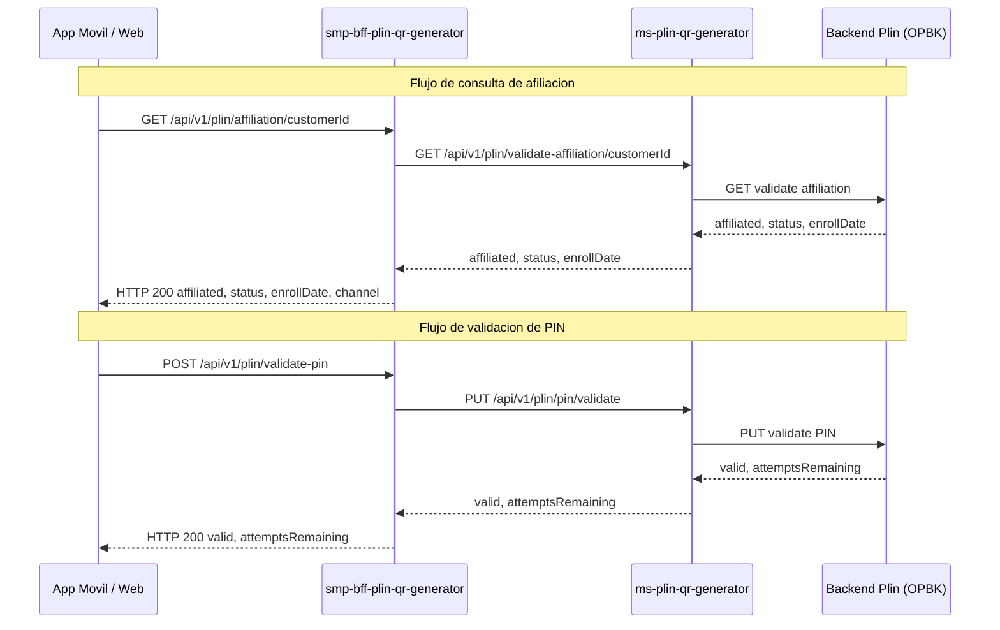

# HU — Extender BFF con endpoints de afiliacion y validacion de PIN Plin

## Descripcion breve

El microservicio `smp-bff-plin-qr-generator` actualmente solo expone capacidades de generacion de codigos QR. Se requiere extenderlo con dos nuevos endpoints para consultar el estado de afiliacion Plin de un cliente y validar su PIN, reutilizando la infraestructura existente del BFF.

## ¿Cual es la necesidad?

Hoy las aplicaciones frontend necesitan invocar servicios dispersos para verificar si un cliente esta afiliado a Plin y validar su PIN antes de generar un QR de cobro. Centralizar estos endpoints en el BFF existente evita duplicar configuracion de infraestructura y reduce la superficie de servicios a mantener.

## Narrativa (HU)

**Yo como** BFF de generacion QR Plin
**Quiero** exponer endpoints de consulta de afiliacion y validacion de PIN contra el servicio downstream de Plin
**Para que** las aplicaciones consumidoras puedan verificar la elegibilidad del cliente antes de generar un QR de cobro Plin

## Diagrama de flujo TO BE



## Reglas de Negocio

| #     | Regla                                | Descripcion                                                                                                                                                                                                                                       |
| ----- | ------------------------------------ | ------------------------------------------------------------------------------------------------------------------------------------------------------------------------------------------------------------------------------------------------- |
| RN-01 | Headers corporativos obligatorios    | `x-ibk-ssn-id`, `x-ibk-channel` y `x-ibk-trace-id` son requeridos en cada request. Su ausencia retorna HTTP 400 con codigo `MISSING_HEADERS` antes de procesar la solicitud. La validacion aplica de forma global a ambos endpoints nuevos.       |
| RN-02 | Formato de customerId                | Cadena numerica de exactamente 8 digitos (DNI). Valores vacios, con letras o de longitud distinta a 8 retornan HTTP 400 con codigo `INVALID_CUSTOMER_ID`.                                                                                        |
| RN-03 | Formato de PIN                       | Cadena numerica de exactamente 4 digitos. Valores vacios, con letras o de longitud distinta a 4 retornan HTTP 400 con codigo `INVALID_PIN_FORMAT`.                                                                                                |
| RN-04 | Intentos de validacion de PIN        | Maximo 3 intentos por customerId. El contador es gestionado por el servicio downstream y es persistente por cliente (no por sesion ni por canal). Al cuarto intento el servicio downstream responde con bloqueo y el BFF retorna HTTP 423.          |
| RN-05 | Confidencialidad del PIN             | El PIN nunca se almacena ni se registra en logs; solo se reenvia al servicio downstream.                                                                                                                                                          |
| RN-06 | Trazabilidad                         | Se propaga el `x-ibk-trace-id` en todas las llamadas downstream.                                                                                                                                                                                 |
| RN-07 | Valores permitidos de status         | Los valores validos del campo `status` en la respuesta de afiliacion son: `ACTIVE`, `NOT_ENROLLED`, `SUSPENDED`.                                                                                                                                  |
| RN-08 | Valores permitidos de channel        | Los valores validos del campo `channel` son: `APP_MOVIL`, `WEB`, `BANCA_TELEFONICA`. Es `null` cuando `affiliated` es `false`.                                                                                                                   |

## Contratos de entrada y salida

### GET /api/v1/plin/affiliation/{customerId}

| Campo      | Ubicacion  | Tipo   | Obligatorio | Validacion                     |
| ---------- | ---------- | ------ | ----------- | ------------------------------ |
| customerId | Path param | String | Si          | 8 digitos numericos (RN-02)    |

**Respuesta exitosa (HTTP 200):**

```json
{
  "affiliated": true,
  "status": "ACTIVE",
  "enrollDate": "2025-03-15",
  "channel": "APP_MOVIL"
}
```

### POST /api/v1/plin/validate-pin

| Campo      | Ubicacion    | Tipo   | Obligatorio | Validacion                     |
| ---------- | ------------ | ------ | ----------- | ------------------------------ |
| customerId | Request body | String | Si          | 8 digitos numericos (RN-02)    |
| pin        | Request body | String | Si          | 4 digitos numericos (RN-03)    |

**Respuesta exitosa (HTTP 200):**

```json
{
  "valid": true,
  "attemptsRemaining": 3
}
```

## Criterios de Aceptacion

### CA 01 — Consulta exitosa de afiliacion

Dado un customerId "12345678" valido y afiliado a Plin, cuando se invoca `GET /api/v1/plin/affiliation/12345678` con los headers `x-ibk-ssn-id: "sess-001"`, `x-ibk-channel: "APP_MOVIL"` y `x-ibk-trace-id: "trace-001"`, entonces el sistema responde con HTTP 200 y cuerpo JSON `{"affiliated": true, "status": "ACTIVE", "enrollDate": "2025-03-15", "channel": "APP_MOVIL"}`.

### CA 02 — Cliente no afiliado a Plin

Dado un customerId "87654321" valido pero no afiliado a Plin, cuando se invoca `GET /api/v1/plin/affiliation/87654321` con los headers corporativos, entonces el sistema responde con HTTP 200 y cuerpo JSON `{"affiliated": false, "status": "NOT_ENROLLED", "enrollDate": null, "channel": null}`.

### CA 03 — Validacion exitosa de PIN

Dado un cliente afiliado con customerId "12345678" y PIN activo, cuando se invoca `POST /api/v1/plin/validate-pin` con el payload `{"customerId": "12345678", "pin": "1234"}` y los headers corporativos, entonces el sistema responde con HTTP 200 y cuerpo JSON `{"valid": true, "attemptsRemaining": 3}`.

### CA 04 — Validacion con PIN incorrecto

Dado un cliente afiliado con customerId "12345678" y PIN activo con 3 intentos restantes, cuando se invoca `POST /api/v1/plin/validate-pin` con el payload `{"customerId": "12345678", "pin": "9999"}`, entonces el sistema responde con HTTP 400 y cuerpo JSON `{"error": "INVALID_PIN", "message": "El PIN ingresado es incorrecto", "attemptsRemaining": 2}`. El codigo HTTP 400 con error `INVALID_PIN` es el codigo definitivo para PIN incorrecto.

### CA 05 — Cliente bloqueado por exceso de intentos

Dado un cliente con customerId "12345678" que ha agotado sus 3 intentos de validacion de PIN (contador persistente por customerId en el servicio downstream, no por sesion ni por canal), cuando se invoca `POST /api/v1/plin/validate-pin` con cualquier PIN, entonces el sistema responde con HTTP 423 y cuerpo JSON `{"error": "PIN_BLOCKED", "message": "El PIN ha sido bloqueado por exceso de intentos"}`.

### CA 06 — Error de comunicacion con servicio downstream

Dado que `ms-plin-qr-generator` no responde (timeout) o responde con error 5xx, cuando se invoca cualquiera de los dos endpoints nuevos (`GET /api/v1/plin/affiliation/{customerId}` o `POST /api/v1/plin/validate-pin`), entonces el sistema responde con HTTP 502 y cuerpo JSON `{"error": "DOWNSTREAM_ERROR", "message": "Error al comunicarse con el servicio de Plin"}`, y registra el error con el `x-ibk-trace-id`. El comportamiento de error es identico para ambos endpoints dado que comparten el mismo servicio downstream y la misma logica de manejo de errores.

### CA 07 — Rechazo por headers corporativos faltantes

Dado que una solicitud a cualquiera de los dos endpoints nuevos no incluye alguno de los headers obligatorios (`x-ibk-ssn-id`, `x-ibk-channel` o `x-ibk-trace-id`), entonces el sistema responde con HTTP 400 y cuerpo JSON `{"error": "MISSING_HEADERS", "message": "Los headers corporativos obligatorios no estan presentes en la solicitud"}` antes de procesar cualquier logica de negocio. La validacion de headers es global y se aplica de forma identica a ambos endpoints (RN-01).

## Endpoints nuevos

| Metodo | Endpoint                                | Descripcion                                        |
| ------ | --------------------------------------- | -------------------------------------------------- |
| GET    | /api/v1/plin/affiliation/{customerId}   | Consultar estado de afiliacion Plin del cliente     |
| POST   | /api/v1/plin/validate-pin               | Validar PIN de Plin del cliente                     |

## Dependencias

| Servicio              | Tipo                          | Descripcion                                          |
| --------------------- | ----------------------------- | ---------------------------------------------------- |
| ms-plin-qr-generator  | Downstream HTTP (existente)   | Servicio existente que gestiona la logica de Plin     |

## Fuera del Alcance

- Realizar transferencias Plin (solo consulta y validacion)
- Gestionar afiliacion o desafiliacion (alta/baja de Plin)
- Cambio o reseteo de PIN
- Modificaciones al flujo existente de generacion QR

## Estimacion

| Campo        | Valor         |
| ------------ | ------------- |
| Story Points | 3             |
| Sprint       | Sprint 2026-14 |

## Control de Versiones

| Version | Descripcion                                                          | Fecha      | Responsable  | Estado      |
| ------- | -------------------------------------------------------------------- | ---------- | ------------ | ----------- |
| 1.0     | Extension del BFF con endpoints de afiliacion y validacion PIN       | 2026-06-30 | Alvaro Diaz  | EN REVISION |
